# Coding Agents Pipeline

A generic, extensible AI agent pipeline that turns PRDs into Pull Requests using AI coding agents (Claude Code or Gemini CLI) with Ralph Loops and Dev Containers.

## How It Works

```mermaid
flowchart LR
    M["Manifest"] --> O["Orders\n(sequential)"]

    subgraph Order["Each Order"]
        direction TB
        P1["PRD A"] & P2["PRD B"] & P3["PRD C"]
    end
    O --> Order

    subgraph WU["Each PRD × Repo"]
        direction LR
        Ctx["Context\nSkills"] --> Agents
        subgraph Agents["Agent Sequence"]
            direction LR
            A["Architect"] --> Des["Designer"] --> Mig["Migration"] --> Dev["Developer"] --> Acc["A11y"]
            Acc --> T["Tester"] --> Perf["Perf"] --> S["SecOps"] --> Dep["Deps"]
            Dep --> I["Infra"] --> DO["DevOps"] --> Rb["Rollback"] --> Doc["Docs"] --> R["Reviewer"]
        end
    end
    Order -->|"parallel\n+ per-repo context"| WU

    WU -->|"rebase\n+ evidence"| PR["Pull\nRequests"]
```



A **manifest** JSON defines the execution plan: a sequence of **orders**, each containing **PRDs** that run in parallel. Each PRD targets one or more **repositories**, each with its own branch and context skills. Every PRD x repo combination runs as an independent pipeline inside a Dev Container, with each agent operating in a Ralph Loop.

### Agent Roles

| Agent | Responsibility | Output |
|-------|---------------|--------|
| **Architect** | System design, tech decisions, file structure | `architecture.md`, dependency plan |
| **Designer** | UI/UX specs, component design, visual specs | Design specs, component hierarchy |
| **Migration** | Database migration generation and validation | `migration-plan.md`, migration files |
| **Developer** | Implementation based on architecture + design | Working code, commits |
| **Accessibility** | WCAG audit, ARIA, keyboard nav, contrast | `accessibility-report.md`, a11y fixes |
| **Tester** | Test strategy, test implementation, coverage | Tests, coverage reports |
| **Performance** | Profiling, benchmarks, query and bundle analysis | `performance-report.md`, optimizations |
| **SecOps** | Security hardening and vulnerability remediation | Security report, security fixes |
| **Dependency** | License compliance, vulnerability and maintenance audit | `dependency-report.md`, audit results |
| **Infrastructure** | Runtime/deployment infrastructure validation | Infrastructure plan, env contracts |
| **DevOps** | CI/CD and release readiness automation | DevOps runbook, pipeline updates |
| **Rollback** | Rollback procedures, feature flags, monitoring triggers | `rollback-plan.md`, rollback runbook |
| **Documentation** | README, API docs, changelog, migration guides | `documentation-summary.md`, doc updates |
| **Reviewer** | Code review, quality gates, final fixes | Review notes, fix commits |

## Installation

### Quick Install (recommended)

```bash
curl -fsSL https://raw.githubusercontent.com/delehner/coding-agents/main/scripts/install.sh | bash
```

This clones the repo to `~/.coding-agents` and symlinks `ca` to `/usr/local/bin/ca` so you can run it from anywhere. Works on macOS and Linux.

Options:

```bash
# Custom install directory
curl -fsSL ... | bash -s -- --dir ~/my-agents

# Custom bin directory (e.g., if /usr/local/bin needs sudo)
curl -fsSL ... | bash -s -- --bin-dir ~/.local/bin

# Install from a specific branch
curl -fsSL ... | bash -s -- --branch feature/experimental

# Uninstall
curl -fsSL ... | bash -s -- --uninstall
```

#### Install Cursor Skills

After installing, you can optionally install Cursor-compatible agent skills:

```bash
# Install skills to ~/.cursor/skills/ (global)
./scripts/install-skills.sh

# Install skills to a specific project
./scripts/install-skills.sh --project ~/my-project
```

### Manual Install

```bash
git clone https://github.com/delehner/coding-agents.git
cd coding-agents
chmod +x ca
# Either symlink to PATH:
ln -sf "$(pwd)/ca" /usr/local/bin/ca
# Or use directly:
./ca help
```

### Prerequisites

- **AI CLI** (at least one):
  - [Claude Code CLI](https://docs.claude.com/en/docs/claude-code) — `npm install -g @anthropic-ai/claude-code`
  - [Gemini CLI](https://github.com/google-gemini/gemini-cli) — `npm install -g @google/gemini-cli`
- [Docker Desktop](https://www.docker.com/) + [Dev Containers CLI](https://github.com/devcontainers/cli) — `npm install -g @devcontainers/cli`
- [GitHub CLI](https://cli.github.com/) — `brew install gh && gh auth login`
- **jq** — `brew install jq` (required for manifest parsing)
- **Claude**: Claude Max subscription or an Anthropic API key. For Dev Container runs with Claude Max: generate `CLAUDE_CODE_OAUTH_TOKEN` via `claude setup-token` and set it in `.env`
- **Gemini**: Google AI API key (from aistudio.google.com) or Google account auth (`gemini auth login`). For Dev Container runs, set `GEMINI_API_KEY` in `.env`

> See **[docs/prerequisites.md](docs/prerequisites.md)** for the full setup guide.

## Quick Start

### 1. Configure

```bash
cd ~/.coding-agents   # or wherever you installed
cp .env.example .env
# Edit .env with your preferences
```

### 2. Set Up MCP Servers

```bash
# GitHub (required — used by all agents for repo context and PR creation)
claude mcp add --transport http github https://api.githubcopilot.com/mcp/

# Notion (optional — project docs and ticket tracking)
claude mcp add --transport http notion https://mcp.notion.com/mcp

# Figma (optional — design specs, used primarily by the Designer agent)
claude mcp add --transport http figma https://mcp.figma.com/mcp

# Slack (optional — team context, notifications, decision history)
claude mcp add --transport http slack https://mcp.slack.com/mcp

# Jira (optional — issue tracking, requires env vars in .env)
claude mcp add jira \
  -e JIRA_URL="$JIRA_URL" \
  -e JIRA_EMAIL="$JIRA_EMAIL" \
  -e JIRA_API_TOKEN="$JIRA_API_TOKEN" \
  -- npx -y @anthropic/jira-mcp

# Authenticate each server
claude  # then run /mcp inside the session
```

### 3. Create a Manifest

A manifest ties together PRDs, repositories, contexts, and execution order.

```json
{
  "name": "My Project",
  "description": "Platform modernization across API and web repos",
  "orders": [
    {
      "name": "1 - Foundation",
      "description": "Core infrastructure and shared libraries",
      "prds": [
        {
          "prd": "./prds/01-setup.md",
          "agents": ["architect", "designer"],
          "repositories": [
            {
              "url": "https://github.com/org/repo",
              "branch": "main",
              "context": "./contexts/repo",
              "agents": ["developer", "tester", "reviewer"]
            }
          ]
        }
      ]
    }
  ]
}
```

Key concepts:
- **Orders** run sequentially — merge PRs from order N before order N+1 starts
- **PRDs** within an order run in parallel (up to `--max-parallel`, default 4). When multiple PRDs target the same repo, they are automatically serialized into **waves** with **stacked branches** to prevent merge conflicts. Each subsequent PRD branches from the previous one's feature branch, and PRs target the previous branch, forming a merge chain
- Each **repository** has its own context directory (or file), branch, and URL
- **Context skills** are assembled into an ephemeral context file (`CLAUDE.md` or `GEMINI.md`) in the working directory — never committed to the target repo
- **Agents** can be specified per-PRD and/or per-repo — they combine (PRD-level first, then repo-level). Omit both to use the global default
- **Working Branch** — each PRD declares a `**Working Branch**` in its metadata (e.g. `delehner/01-foundation`). The pipeline uses it as the feature branch name, falling back to auto-generation if not specified
- **Rebase before PR** — before creating a PR, the pipeline rebases the feature branch onto the latest target branch to reduce conflicts from cross-order drift or external changes
- **PR Evidence** — after PR creation, agent reports (tester, performance, secops, dependency, infrastructure, devops by default) are posted as PR comments. Configurable via `EVIDENCE_AGENTS` env var or `--evidence-agents` flag
- **Empty repos** — when the target repo has no branches, the pipeline seeds `main` with an initial commit and works directly on it. No feature branch or PR is created; the finished `main` is pushed at the end

See `templates/manifest.json` for the full template and `manifests/portfolio.json` for a real example.

### 4. Run the Pipeline

The `ca` CLI is the single entry point — it always enables verbose log formatting (thinking, tool calls, results) and always enforces Dev Containers.

```bash
# Run a full manifest (orders execute sequentially, PRDs in parallel)
ca orchestrate --manifest ./manifests/my-project.json

# Run a specific order only
ca orchestrate --manifest ./manifests/my-project.json --order 1

# Skip confirmation prompts between orders
ca orchestrate --manifest ./manifests/my-project.json --auto

# Limit parallelism or run sequentially
ca orchestrate --manifest ./manifests/my-project.json --max-parallel 2
ca orchestrate --manifest ./manifests/my-project.json --sequential

# Single PRD × single repo
ca pipeline \
  --prd ./prds/my-feature.md \
  --repo https://github.com/org/repo \
  --context ./contexts/repo

# Skip PR creation (useful for testing)
ca pipeline --prd ./prds/my-feature.md --repo <url> --context <path> --skip-pr

# Run a single agent in a Ralph Loop (useful for testing prompts)
ca run --agent developer --workdir ./my-repo --prd ./prds/my-feature.md
```

#### Key Flags

| Flag | Commands | Description |
|------|----------|-------------|
| `--interactive` | `orchestrate`, `pipeline` | Pause between agents and iterations for review |
| `--follow <agent>` | `orchestrate`, `pipeline` | Focus output on a specific agent |
| `--skip-pr` | `orchestrate`, `pipeline` | Don't create PRs (testing) |
| `--max-parallel <n>` | `orchestrate` | Max concurrent pipelines (default: 4) |
| `--sequential` | `orchestrate` | Run work units one at a time |
| `--order <n>` | `orchestrate` | Run only a specific order |
| `--auto` | `orchestrate` | Skip confirmation prompts between orders |
| `--evidence-agents <list>` | `orchestrate`, `pipeline` | Agents whose reports are posted as PR comments |
| `--provider <name>` | all | AI provider: `claude` (default) or `gemini` |
| `--model <name>` | `orchestrate`, `pipeline`, `run` | Override the AI model |
| `--max-iterations <n>` | `orchestrate`, `pipeline`, `run` | Cap Ralph Loop iterations |
| `--workdir <path>` | `pipeline`, `run` | Working directory for cloned repos |

### Monitoring & Interaction

```bash
# Interactive mode: pause between agents and iterations for review
ca orchestrate --manifest ./manifests/my-project.json --interactive

# Focus on a specific agent's output
ca orchestrate --manifest ./manifests/my-project.json --follow developer

# Monitor logs from another terminal while the pipeline runs
ca monitor                                    # all logs
ca monitor --agent developer                  # specific agent
ca monitor --sessions                         # list resumable sessions
ca monitor --raw                              # raw JSON event stream

# Re-format a raw .jsonl log for reading
ca logs ./logs/developer_iteration_1.jsonl
ca logs ./logs/developer_iteration_1.jsonl --truncate 1000

# Resume an agent session interactively (from session ID)
claude --resume <session-id>    # Claude
gemini --resume <session-id>    # Gemini
```

### 5. Dev Containers (Default)

Agents run inside Dev Containers automatically — each PRD x repo gets its own isolated container. No extra setup beyond having Docker running. The `ca` CLI enforces this (the `--no-devcontainer` flag is blocked).

## Project Structure

```
coding-agents/
├── ca                           # Unified CLI (always verbose logs, always dev containers)
├── scripts/
│   ├── install.sh               # curl-based installer for macOS and Linux
│   └── install-skills.sh        # Install Cursor skills locally
├── pipeline/
│   ├── orchestrator.sh          # Manifest orchestrator: orders → PRDs → repos → PRs
│   ├── run-pipeline.sh          # Single PRD × single repo pipeline
│   ├── run-agent.sh             # Ralph Loop wrapper for a single agent
│   ├── generate-context.sh      # Context skill generator (analyzes repos)
│   ├── generate-prd.sh          # PRD and manifest generator (interactive prompt)
│   ├── monitor.sh               # Real-time log monitor (tail, filter, session list)
│   └── lib/
│       ├── prd-parser.sh        # Parse PRD metadata (status, title)
│       ├── git-utils.sh         # Branch management, rebase, and PR creation
│       ├── progress.sh          # Progress tracking between iterations
│       ├── validation.sh        # Completion criteria checks
│       ├── context.sh           # Context skill assembly
│       ├── provider.sh          # AI provider abstraction (Claude / Gemini)
│       └── log-formatter.sh     # Stream-json → human-readable log formatter
├── agents/
│   ├── _base-system.md          # Shared base instructions for all agents
│   ├── architect/prompt.md
│   ├── designer/prompt.md
│   ├── migration/prompt.md
│   ├── developer/prompt.md
│   ├── accessibility/prompt.md
│   ├── tester/prompt.md
│   ├── performance/prompt.md
│   ├── secops/prompt.md
│   ├── dependency/prompt.md
│   ├── infrastructure/prompt.md
│   ├── devops/prompt.md
│   ├── rollback/prompt.md
│   ├── documentation/prompt.md
│   ├── reviewer/prompt.md
│   ├── context-generator/prompt.md
│   └── prd-generator/prompt.md
├── manifests/                   # Manifest JSON files (orders + PRDs + repos + contexts)
│   └── portfolio.json
├── prds/                        # Product Requirements Documents
├── logs/                        # Runtime logs (.jsonl, .log, .session — gitignored)
├── contexts/                    # Per-repo context skill directories
│   └── <repo-name>/            # Skills: overview.md, architecture.md, conventions.md, ...
├── templates/
│   ├── manifest.json            # Manifest template
│   ├── prd.md                   # PRD template
│   ├── project-context.md       # Legacy single-file context template
│   └── context-skill.md         # Context skill template (directory-based)
├── skills/                      # Cursor-compatible agent skills
├── .devcontainer/
│   ├── devcontainer.json        # Dev Container for editing this repo
│   ├── agent/                   # Dev Container for running agents (headless)
│   │   ├── devcontainer.json
│   │   └── Dockerfile
│   ├── Dockerfile
│   └── init-firewall.sh
├── docs/                        # Documentation with diagrams
├── config/
│   └── settings.json            # Claude Code / Gemini CLI settings templates
├── .mcp.json                    # MCP server configuration
├── .env.example                 # Environment variables template
├── CLAUDE.md                    # Instructions for this repo
└── README.md
```

## Adapting to Your Project

### For Personal Projects

1. Generate context skills for your repo: `ca generate context --repo <path-or-url> --output ./contexts/my-repo`
2. Review and refine the generated skills in `contexts/my-repo/`
3. Generate PRDs and a manifest — the script prompts you to describe what you want built:
   ```bash
   ca generate prd \
     --output ./prds/my-app \
     --manifest ./manifests/my-app.json \
     --repo https://github.com/org/my-repo --context ./contexts/my-repo

   # What do you want to build?
   # > Fix the CI/CD pipeline, add Terraform IaC, set up monitoring
   # >
   ```
4. Review the generated PRDs and manifest, then run: `ca orchestrate --manifest ./manifests/my-app.json`

> You can also write PRDs manually using `templates/prd.md`.

### For Company Projects

Context skills are injected as an ephemeral context file (`CLAUDE.md` or `GEMINI.md`) that **never gets committed** to target repos.

1. Generate context skills for each repo: `ca generate context --repo <url> --output ./contexts/my-repo`
2. Review and customize the skills — add company-specific conventions, security policies, etc.
3. Generate PRDs and manifest — the script prompts you to describe the work:
   ```bash
   ca generate prd \
     --output ./prds/platform \
     --manifest ./manifests/platform.json \
     --repo https://github.com/org/api --context ./contexts/api \
     --repo https://github.com/org/web --context ./contexts/web
   ```
4. Review, adjust, and run. Connect Jira/Notion MCPs for ticket tracking

### Adding New Agents

Create a new directory under `agents/` with a `prompt.md` file following the existing format. Register the agent in `run-pipeline.sh`. See `docs/adding-agents.md` for a step-by-step guide.

## Configuration

### Environment Variables

Copy `.env.example` to `.env` and customize. Key variables:

| Variable | Default | Description |
|----------|---------|-------------|
| `AI_PROVIDER` | `claude` | AI provider: `claude` or `gemini` |
| `ANTHROPIC_API_KEY` | _(blank)_ | API key for pay-per-token. Leave blank for Claude Max |
| `CLAUDE_CODE_OAUTH_TOKEN` | _(blank)_ | OAuth token for headless/container runs (`claude setup-token`) |
| `GEMINI_API_KEY` | _(blank)_ | Google AI API key for Gemini CLI. Leave blank for Google account auth |
| `CLAUDE_MODEL` | `sonnet` | Default model (Claude provider) |
| `GEMINI_MODEL` | `gemini-2.5-pro` | Default model (Gemini provider) |
| `<AGENT>_MODEL` | _(falls back to provider default)_ | Per-agent model override (e.g. `REVIEWER_MODEL=opus`) |
| `PIPELINE_MAX_ITERATIONS` | `10` | Max Ralph Loop iterations per agent |
| `<AGENT>_MAX_ITERATIONS` | _(falls back to global)_ | Per-agent iteration cap (e.g. `DEVELOPER_MAX_ITERATIONS=20`) |
| `PIPELINE_MAX_PARALLEL` | `4` | Max concurrent PRD×repo pipelines |
| `DEFAULT_BASE_BRANCH` | `main` | Default base branch for PRs |
| `PIPELINE_CLEANUP` | `false` | Clean up working directory after PR creation |
| `EVIDENCE_AGENTS` | `tester,performance,secops,dependency,infrastructure,devops` | Agents whose reports are posted as PR comments |
| `UPDATE_PROJECT_CONTEXT` | `true` | Auto-update project context in target repo after agents |
| `LOG_DIR` | `./logs` | Directory for log files |
| `INTERACTIVE` | `false` | Pause between agents/iterations for review |

See `.env.example` for the complete list including optional integrations (Notion, Figma, Slack, Jira).

### MCP Servers

The pipeline connects to external services via MCP (Model Context Protocol). Server configs in `.mcp.json` are committed to git so your team shares the same integrations.

| Server | Transport | Used By | Purpose |
|--------|-----------|---------|---------|
| **GitHub** (required) | HTTP | All agents | Repos, PRs, issues, code context |
| **Notion** | HTTP | Any agent | Project docs, databases, ticket tracking |
| **Figma** | HTTP | Designer | Design tokens, component specs, screenshots |
| **Slack** | HTTP | Any agent | Team context, notifications, decision history |
| **Jira** | stdio | Any agent | Issue tracking (requires `JIRA_URL`, `JIRA_EMAIL`, `JIRA_API_TOKEN` in `.env`) |

See **[docs/mcp-integrations.md](docs/mcp-integrations.md)** for detailed setup, authentication, and how to add new servers.

## Cost Considerations

Ralph Loops consume API tokens per iteration. With a **Claude Max subscription** or **Gemini free tier**, usage is unlimited (subject to rate limits). With **API keys**, typical costs per agent per PRD (Claude, estimates):

| Agent | Iterations (avg) | Est. Cost (API) |
|-------|------------------|-----------------|
| Architect | 2-4 | $2-8 |
| Designer | 2-5 | $2-10 |
| Migration | 2-4 | $2-6 |
| Developer | 5-15 | $10-30 |
| Accessibility | 2-4 | $2-6 |
| Tester | 3-8 | $5-15 |
| Performance | 2-5 | $3-8 |
| SecOps | 2-5 | $3-8 |
| Dependency | 2-4 | $2-6 |
| Infrastructure | 2-4 | $2-6 |
| DevOps | 2-4 | $2-6 |
| Rollback | 2-4 | $2-6 |
| Documentation | 2-4 | $2-6 |
| Reviewer | 2-5 | $2-10 |

## License

MIT
