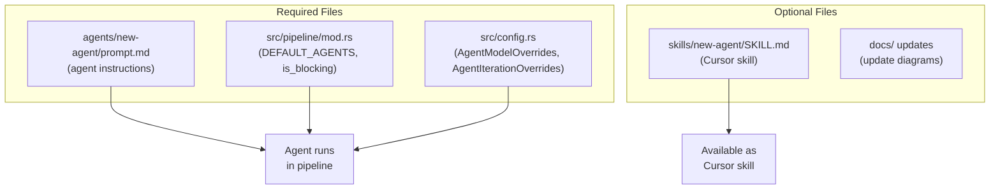

# Adding New Agents

This guide explains how to add a new agent to the pipeline.

## Architecture



## Step-by-Step

### 1. Create the Prompt File

Create `agents/<name>/prompt.md` with this structure:

```markdown
# <Name> Agent

You are the **<Name> Agent**. You run after the <previous> agent.
Your job is to <one-line description>.

## Your Responsibilities
1. First responsibility
2. Second responsibility

## Output Artifacts

### `.agent-progress/<name>.md`
Your progress tracking file.

### `docs/architecture/<prd-slug>/<artifact>.md`
Description of the artifact.

## Guidelines
- Guideline 1
- Guideline 2

## Completion Criteria
You are COMPLETED when:
- [ ] Criterion 1
- [ ] Criterion 2
- [ ] Progress file status is set to COMPLETED
```

Rules:
- Don't duplicate content from `_base-system.md`
- Completion criteria must be testable checkboxes
- Specify which prior agents' output this agent reads
- Prompts are provider-agnostic — they work with both Claude Code and Gemini CLI

### 2. Register in the Pipeline

Edit `src/pipeline/mod.rs`:

1. Add the agent to `DEFAULT_AGENTS` in the desired position:

```rust
pub const DEFAULT_AGENTS: &[&str] = &[
    "architect",
    "designer",
    "migration",
    "developer",
    "accessibility",
    "tester",
    "performance",
    "secops",
    "dependency",
    // "compliance",  // new agent
    "infrastructure",
    "devops",
    "rollback",
    "documentation",
    "reviewer",
];
```

2. Update `NON_BLOCKING_AGENTS` and `is_blocking()` if the agent should not block the pipeline on failure:

```rust
pub const NON_BLOCKING_AGENTS: &[&str] = &[
    "designer",
    "migration",
    "accessibility",
    "performance",
    "dependency",
    "rollback",
    "documentation",
    // "compliance",  // add if non-blocking
];
```

The position determines:
- Which agents run before (their progress is passed as context)
- Which agents run after (they'll receive this agent's progress)

### 3. Add Per-Agent Config Fields

Edit `src/config.rs` and add the new agent to both structs:

1. **AgentModelOverrides** — add a field and match arm:

```rust
pub struct AgentModelOverrides {
    // ... existing fields ...
    pub compliance: Option<String>,  // new agent
}

// In for_agent():
"compliance" => self.compliance.as_deref(),
```

2. **AgentIterationOverrides** — add a field and match arm:

```rust
pub struct AgentIterationOverrides {
    // ... existing fields ...
    pub compliance: Option<u32>,  // new agent
}

// In for_agent():
"compliance" => self.compliance,
```

3. In `Config::load()`, add the env var bindings:

```rust
agent_models: AgentModelOverrides {
    // ... existing ...
    compliance: env_opt("COMPLIANCE_MODEL"),
},
agent_max_iterations: AgentIterationOverrides {
    // ... existing ...
    compliance: env_parse("COMPLIANCE_MAX_ITERATIONS"),
},
```

### 4. Add Environment Variable Entries

In `.env.example`, add optional model and iteration overrides:

```bash
# Per-Agent Model Overrides
COMPLIANCE_MODEL=

# Agent-Specific Overrides (max iterations)
COMPLIANCE_MAX_ITERATIONS=
```

Naming conventions:
- Model: `<AGENT_NAME_UPPER>_MODEL`
- Iterations: `<AGENT_NAME_UPPER>_MAX_ITERATIONS`

### 5. Create a Cursor Skill (Optional)

Create `skills/<name>/SKILL.md` to make this agent's capability available as a standalone Cursor skill:

```markdown
---
name: <name>-review
description: >-
  Description of what this skill does and when to use it.
---

# <Name>

## When to Use
- Trigger scenarios

## Process
1. Steps

## Output Template
Template content
```

### 6. Update Documentation

Update the following files to reflect the new agent:
- `docs/pipeline-overview.md` — add to flow diagrams
- `README.md` — add to the agent roles table
- `CLAUDE.md` — mention if it affects project structure or conventions

## Example: Adding a Compliance Agent

```mermaid
flowchart LR
    A1[Architect] --> A2[Designer]
    A2 --> A3[Migration]
    A3 --> A4[Developer]
    A4 --> A5[Accessibility]
    A5 --> A6[Tester]
    A6 --> A7[Performance]
    A7 --> A8[SecOps]
    A8 --> A9[Dependency]
    A9 --> New[Compliance]
    New --> A10[Infrastructure]
    A10 --> A11[DevOps]
    A11 --> A12[Rollback]
    A12 --> A13[Documentation]
    A13 --> A14[Reviewer]
    A14 --> PR[PullRequest]

    style New fill:#ff9,stroke:#333
```



This agent would:
- Run after Dependency (reads dependency and security reports)
- Run before Infrastructure (infrastructure decisions can incorporate compliance findings)
- Verify regulatory compliance (SOC2, HIPAA, GDPR), audit logging, data retention policies
- Produce `docs/architecture/<prd-slug>/compliance-report.md`
