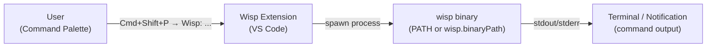

# Architecture: VS Code Extension Documentation & Guides

## Overview

This PRD adds comprehensive user-facing documentation for the Wisp VS Code extension. It is a **docs-only PRD** — no TypeScript or Rust source changes. The deliverables are three new markdown files under `docs/`, a rewritten `vscode-extension/README.md`, and targeted updates to four existing docs.

Engineers discovering Wisp via the VS Code Marketplace currently have no documentation. Existing CLI users do not know the extension exists. This work closes that gap.

---

## System Design

### Components

This PRD introduces no new software components. All changes are documentation:

| Artifact | Type | Action |
|----------|------|--------|
| `docs/vscode-extension.md` | New file | Feature guide: commands, sidebar, config, status bar |
| `docs/vscode-install.md` | New file | User installation guide (Marketplace, VSIX, source) |
| `docs/vscode-publish.md` | New file | Maintainer publishing guide (VSCE PAT, tags, rotation) |
| `vscode-extension/README.md` | Rewrite | Marketplace listing — sell the extension, link to docs |
| `docs/prerequisites.md` | Update | Add VS Code Extension as optional install method |
| `docs/project-structure.md` | Update | Add `vscode-extension/` row + new doc rows to tables |
| `docs/pipeline-overview.md` | Update | Add "Running from VS Code" section |
| `CLAUDE.md` | Update | Add 3 new doc filenames to key docs list |

### Data Flow



This diagram must appear in `docs/vscode-extension.md` to show how command palette invocations translate to CLI subcommand executions.

### Data Models

No data models introduced. The extension contributes:

**Commands** (from `vscode-extension/package.json` `contributes.commands`):
- Document only commands actually registered in `package.json`. At time of writing, only `wisp.showVersion` is present. Developer agent must read `package.json` at write-time and document the real command list — do not synthesize commands not present.

**Configuration** (from `package.json` `contributes.configuration`):

| Setting | Type | Default | Scope | Description |
|---------|------|---------|-------|-------------|
| `wisp.binaryPath` | string | `""` (empty = use PATH) | machine-overridable | Absolute path to wisp binary |

**Activation events** (from `package.json` `activationEvents`):
- `onCommand:wisp.*` — any Wisp command invocation
- `workspaceContains:**/manifests/*.json` — workspace has a manifests directory
- `workspaceContains:**/prds/**/*.md` — workspace has PRD files

### API Contracts

The extension has no public API. It is a pure consumer of the `wisp` CLI binary via `child_process` spawn.

---

## File Structure

No new source files are created. All changes are to markdown files:

```
docs/
├── vscode-extension.md      # NEW — feature guide
├── vscode-install.md        # NEW — installation guide
├── vscode-publish.md        # NEW — maintainer publishing guide
├── prerequisites.md         # UPDATE — add VS Code Extension section
├── project-structure.md     # UPDATE — add vscode-extension/ and new doc rows
└── pipeline-overview.md     # UPDATE — add "Running from VS Code" section

vscode-extension/
└── README.md                # REWRITE — marketplace-facing listing

CLAUDE.md                    # UPDATE — add 3 new doc filenames to key docs list
```

---

## Technical Decisions

| Decision | Choice | Rationale | Alternatives Considered |
|----------|--------|-----------|------------------------|
| Doc location | `docs/` (not `vscode-extension/docs/`) | Consistent with all other project docs | Separate `vscode-extension/docs/` would fragment the docs site |
| README purpose | Marketplace-facing listing (rewrite) | VS Code Marketplace uses this README as the listing page | Keep as dev guide and add a separate marketplace README |
| Cross-doc links in README.md | Absolute GitHub URLs | Marketplace renders README outside repo context; relative links break | Relative links (breaks on Marketplace) |
| Mermaid for command flow | Yes — one diagram in vscode-extension.md | Consistent with `docs/pipeline-overview.md` and `docs/adding-agents.md` style | Prose description only |
| CLAUDE.md update | Yes | PRD explicitly requires it; `CLAUDE.md` key docs list must stay current | Skip (creates stale docs index) |

---

## Dependencies

- **PRD 01** (extension commands): `package.json` is the source of truth. Developer agent must read it at write-time. Currently only `wisp.showVersion` is registered. If PRD 01 commands land before this PR merges, the command table must include all registered commands.
- **PRD 02** (sidebar tree view): `package.json` contributes.views and contributes.viewsContainers would be present if PRD 02 merged. Developer agent must check for these before documenting a sidebar section.
- **PRD 03** (publish pipeline): `.github/workflows/publish-vscode.yml` is the authoritative source for the publishing guide. It is present and readable.

No new npm packages or Rust crates needed.

---

## Risks & Mitigations

| Risk | Impact | Mitigation |
|------|--------|------------|
| PRDs 01/02 commands not yet in `package.json` when this PR is written | Medium — docs may document fewer commands than shipped | Developer agent reads `package.json` at write-time; note in `docs/vscode-extension.md` header that the doc tracks the latest released version |
| Marketplace README absolute URLs become stale if repo is renamed | Low | Use `main` branch URLs; they redirect on rename |
| VSCE PAT rotation steps reference Azure DevOps UI that may change | Low | Describe the conceptual steps and link to Microsoft's canonical VSCE docs |
| `docs/vscode-extension.md` sidebar section can't be written if PRD 02 hasn't merged | Low | Developer agent conditionally includes the sidebar section based on whether `package.json` has `contributes.views` |

---

## Implementation Tasks

Ordered tasks for the Developer agent (documentation only — no source code):

1. **Read `vscode-extension/package.json`** — extract the exact command IDs, display names, and configuration properties that are registered. This is the single source of truth for the feature guide.

2. **Create `docs/vscode-extension.md`**
   - "Getting Started" section: install extension → open wisp workspace → run first command
   - Commands table: columns = Command ID, Title, Description, How to invoke, Args collected — one row per command in `package.json`
   - `wisp.binaryPath` configuration section with examples
   - Status bar item behavior (Idle / Running, click action) — include only if implemented
   - Sidebar tree view section (Manifests, PRDs, context menus) — include only if `contributes.views` is present in `package.json`
   - Mermaid diagram: User → Command Palette → Extension → wisp binary → output
   - Header note: "This document tracks the latest released version. Command list reflects `vscode-extension/package.json`."

3. **Create `docs/vscode-install.md`**
   - Prerequisites: VS Code ≥ 1.85, wisp CLI on PATH (link to `docs/prerequisites.md`)
   - Method 1 — Marketplace: search "Wisp" in Extensions view, click Install
   - Method 2 — VSIX sideload: download from GitHub Releases, Extensions → … → Install from VSIX…
   - Method 3 — Build from source: `npm ci && npm run compile && npm run package` then Install from VSIX
   - Verification: run "Wisp: Show Version" from command palette, confirm version output
   - Troubleshooting: binary not found → set `wisp.binaryPath`; extension not activating → check activation triggers (manifests/, prds/)

4. **Create `docs/vscode-publish.md`**
   - One-time setup: creating an Azure DevOps publisher account, generating a VSCE PAT with Marketplace (Publish) scope, storing as `VSCE_PAT` GitHub secret
   - Release process: bump version in `vscode-extension/package.json` → commit + push to main → push tag `vscode-vX.Y.Z` → workflow auto-publishes
   - Verify publish: check GitHub Actions run, confirm on VS Code Marketplace
   - PAT rotation: annual renewal recommendation, steps to regenerate and update GitHub secret
   - Optional Open VSX: create publisher at open-vsx.org, generate `OVSX_PAT`, store as GitHub secret (non-blocking if absent)
   - Troubleshooting: PAT expired error, version mismatch error (workflow fails before publish)
   - Reference: `docs/architecture/marketplace-publish/devops.md` for full runbook

5. **Rewrite `vscode-extension/README.md`** (marketplace-facing)
   - Title: `# Wisp for VS Code`
   - Tagline + VS Code Marketplace version badge
   - Feature list: all commands, sidebar tree view (if present), binary auto-detection
   - Quick start: install → run "Wisp: Show Version" to verify
   - Configuration: `wisp.binaryPath` with example
   - Requirements: VS Code ≥ 1.85, wisp CLI on PATH
   - Links (absolute GitHub URLs): `https://github.com/delehner/wisp/blob/main/docs/vscode-install.md`, `https://github.com/delehner/wisp/blob/main/docs/vscode-extension.md`
   - Do NOT use relative `docs/` links — they break on the Marketplace

6. **Update `docs/prerequisites.md`**
   - After the "Installing the `wisp` CLI" section, add "## VS Code Extension (Optional)" with a one-sentence description and link to `docs/vscode-install.md`

7. **Update `docs/project-structure.md`**
   - In the Directory Map mermaid, `vscode-extension/` is already present (line 22 of current file). Verify it shows correctly.
   - In the File Reference table, update the `vscode-extension/README.md` row description from "Local build, test, package..." to "VS Code Marketplace listing — install and usage guide"
   - Add rows for `docs/vscode-extension.md`, `docs/vscode-install.md`, `docs/vscode-publish.md` in the File Reference table under the existing `docs/*.md` row

8. **Update `docs/pipeline-overview.md`**
   - Add a new `## Running from VS Code` section. One paragraph: the VS Code extension maps each command palette command to a `wisp` CLI subcommand, invoked as a subprocess. Reference `docs/vscode-extension.md` for the full command list.

9. **Update `CLAUDE.md`**
   - Locate the key docs list and add `docs/vscode-extension.md`, `docs/vscode-install.md`, `docs/vscode-publish.md`

---

## Security Considerations

- `wisp.binaryPath` is scoped `machine-overridable` (not workspace-level) to prevent workspace-level binary hijacking. Document this in the feature guide with a brief explanation of why.
- VSCE PAT is a sensitive credential. The publishing guide must instruct storing it as a GitHub secret, not in code or `.env`.

## Performance Considerations

Not applicable — this PRD is documentation only.

---

## Style Reference

Follow these conventions from existing docs:

- Headers: `##` for sections, `###` for subsections — no `#` except the document title
- Code blocks: fenced with language tag (` ```bash `, ` ```mermaid `)
- Tables: GitHub-flavored markdown; pipe-aligned columns
- Prose: "VS Code" (with space), "wisp" (lowercase CLI), "Wisp" (capital extension)
- No HTML elements
- Mermaid diagrams: `flowchart TD` or `flowchart LR` consistent with `pipeline-overview.md` and `project-structure.md`
- Command palette invocations: bold, e.g., **Wisp: Show Version**
- Agent table format reference: `docs/adding-agents.md` step 2 — use the same column structure for the commands table
