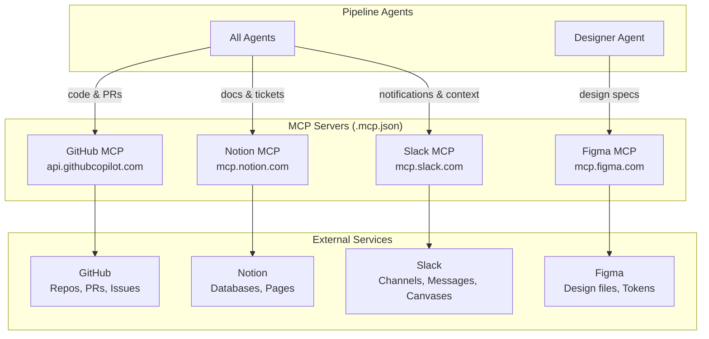

# MCP Integrations

The pipeline connects to external services via MCP (Model Context Protocol) servers. These give agents the ability to interact with GitHub, Notion, Figma, and other tools during execution.

**Provider support**: MCP servers work with **Claude Code** natively. **Gemini CLI** has its own tool and extension system; MCP config in `.mcp.json` is used when running with Claude. When using `--provider gemini`, MCP integrations may not be available depending on Gemini's tool support.

## Configured Servers



## Server Details

### GitHub (Required)
- **URL**: `https://api.githubcopilot.com/mcp/`
- **Transport**: HTTP
- **Used by**: All agents (for repository context), Orchestrator (for PR creation)
- **Capabilities**: Read repos, create PRs, manage issues, read code

### Notion (Optional)
- **URL**: `https://mcp.notion.com/mcp`
- **Transport**: HTTP
- **Used by**: Any agent that needs to read project documentation or update tickets
- **Capabilities**: Read/write pages, query databases, manage blocks

### Figma (Optional)
- **URL**: `https://mcp.figma.com/mcp`
- **Transport**: HTTP
- **Used by**: Designer agent primarily
- **Capabilities**: Extract design tokens, read component specs, capture frame screenshots, access variable collections

### Slack (Optional)
- **URL**: `https://mcp.slack.com/mcp`
- **Transport**: HTTP (Streamable HTTP / JSON-RPC 2.0)
- **Used by**: Any agent that needs team context, pipeline notifications, or decision history
- **Capabilities**: Search channels/messages/files/users, send messages, read threads, create/update canvases, read user profiles
- **Auth**: OAuth 2.0 — requires a registered Slack app with appropriate scopes. Workspace admins must approve the MCP client integration.
- **Docs**: https://docs.slack.dev/ai/mcp-server

## Setup

### Adding a Server via CLI

```bash
# Project-scoped (saved to .mcp.json, committed to git)
claude mcp add --scope project --transport http <name> <url>

# User-scoped (saved to ~/.claude.json, personal)
claude mcp add --scope user --transport http <name> <url>
```

### Authentication

After adding servers, authenticate each one:

```bash
claude        # Start a Claude Code session
# Then inside the session:
/mcp          # Shows all servers, click "Authenticate" for each
```

### Adding Jira

Jira uses stdio transport with environment variables:

```bash
claude mcp add jira \
  -e JIRA_URL="$JIRA_URL" \
  -e JIRA_EMAIL="$JIRA_EMAIL" \
  -e JIRA_API_TOKEN="$JIRA_API_TOKEN" \
  -- npx -y @anthropic/jira-mcp
```

Or add to `.mcp.json` manually:

```json
{
  "mcpServers": {
    "jira": {
      "command": "npx",
      "args": ["-y", "@anthropic/jira-mcp"],
      "env": {
        "JIRA_URL": "${JIRA_URL}",
        "JIRA_EMAIL": "${JIRA_EMAIL}",
        "JIRA_API_TOKEN": "${JIRA_API_TOKEN}"
      }
    }
  }
}
```

## Adding a New MCP Server

1. Add the server config to `.mcp.json`
2. Add any required environment variables to `.env.example`
3. Document the server in this file
4. If agent-specific, update the relevant agent prompt in `agents/<name>/prompt.md`
5. Run `claude` and authenticate via `/mcp`
