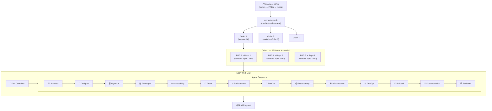
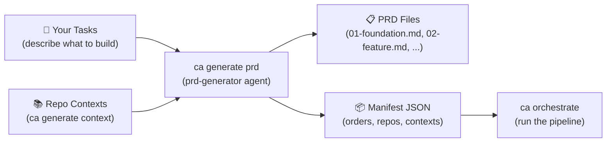
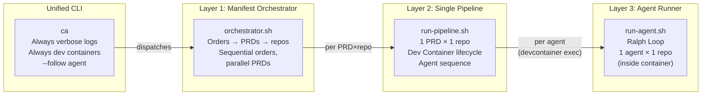
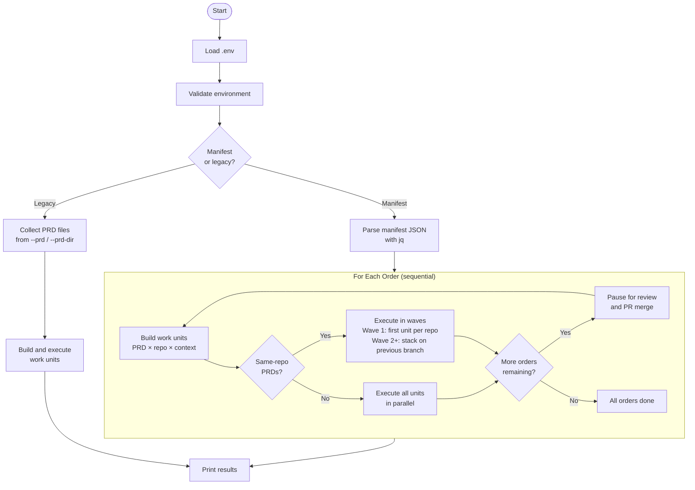
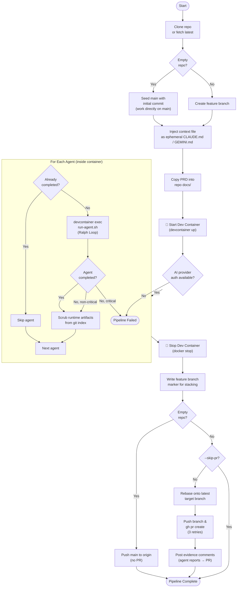
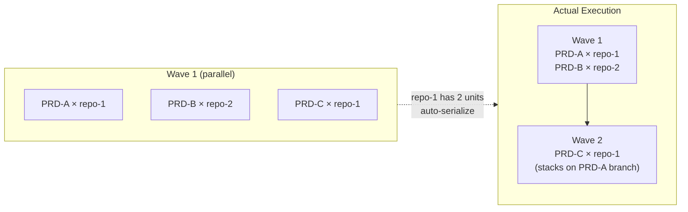
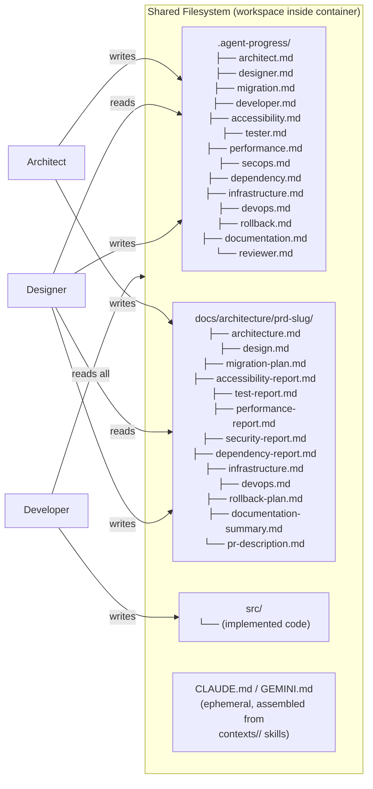

# Pipeline Overview

The Coding Agents Pipeline transforms PRDs into Pull Requests by running specialized AI agents in sequence inside Dev Containers. It supports **Claude Code** and **Gemini CLI** as AI providers (select via `AI_PROVIDER` env var or `ca --provider <name>`). A **manifest** JSON defines the execution plan: sequential **orders**, each containing **PRDs** that run in parallel, each targeting **repositories** with their own context and branch.

## End-to-End Flow



## Pre-Pipeline: PRD Generation

Before running the pipeline, generate PRDs and a manifest using `ca generate prd`. The script prompts you to describe what you want built directly in the terminal, then uses the `prd-generator` agent with repo contexts to decompose your description into ordered, pipeline-ready PRDs.



The typical workflow is:
1. `ca generate context` — analyze repos, produce context skills
2. `ca generate prd` — describe what you want built, produce PRDs and a manifest
3. `ca orchestrate` — execute the manifest (agents process each PRD)

## Architecture



| Script | Scope | Responsibility |
|--------|-------|---------------|
| `ca` | All operations | Unified CLI: wraps all scripts, enforces verbose logs + dev containers, `--provider` for AI selection |
| `generate-prd.sh` | Description → PRDs + manifest | Prompt for a project description, decompose into ordered PRDs and a pipeline manifest |
| `orchestrator.sh` | Manifest → orders → PRDs → repos | Parse manifest, execute orders sequentially, dispatch PRDs in parallel, pause between orders |
| `run-pipeline.sh` | 1 PRD × 1 repo | Clone repo, start Dev Container, inject context, run agents, stop container, create PR |
| `run-agent.sh` | 1 agent | Ralph Loop: build prompt, run AI agent (Claude Code or Gemini CLI via provider.sh), check completion |

## Manifest Structure

```json
{
  "name": "Project Name",
  "orders": [
    {
      "name": "1 - Foundation",
      "prds": [
        {
          "prd": "./prds/01-setup.md",
          "agents": ["architect", "designer"],
          "repositories": [
            {
              "url": "https://github.com/org/repo",
              "branch": "main",
              "context": "./contexts/repo",
              "agents": ["developer", "tester", "reviewer"]
            }
          ]
        }
      ]
    }
  ]
}
```

- **Orders** execute sequentially — merge PRs from order N before order N+1 starts
- **PRDs within an order** execute in parallel. When multiple PRDs target the same repo, they are automatically serialized into **stacking waves** (see below)
- Each **repository** has its own context file, branch, and URL
- **Context** is per-repo — either a directory of skill files (recommended) or a single file. Assembled into ephemeral `CLAUDE.md` (Claude) or `GEMINI.md` (Gemini) at runtime, never committed
- **Agents** can be specified at the PRD level and/or the repository level (see below)

### Per-Unit Agent Selection

Agents can be configured at two levels in the manifest. They combine (not override):

| Level | Key | Scope |
|-------|-----|-------|
| PRD-level `agents` | `orders[].prds[].agents` | Runs for every repository in that PRD |
| Repo-level `agents` | `orders[].prds[].repositories[].agents` | Runs only for that specific repository |

The final agent list for a work unit is: **PRD agents first, then repo agents** — matching the natural flow (design before implementation). If neither level specifies agents, the global `--agents` CLI flag (or built-in default) applies.

**Example:** Given `"agents": ["architect"]` on the PRD and `"agents": ["developer", "tester"]` on a repo, that repo runs: architect, developer, tester.

## Orchestrator Lifecycle



## Single Pipeline Lifecycle (run-pipeline.sh)



### Dev Container Execution Notes

- `run-pipeline.sh` starts the container with `.devcontainer/agent/devcontainer.json`.
- Per-agent `devcontainer exec` uses that same config file, so target repos do not need their own `.devcontainer/devcontainer.json`.
- Pipeline logs are written to the repository root `logs/` directory by default.
- Agent commit identity is propagated from host git config (`user.name` / `user.email`) into container execution.
- Agent runtime logs inside containers are written under `.pipeline/logs` (excluded from git), not the target repo `logs/`.
- Per-agent progress files are cleared at the start of each PRD run to avoid cross-PRD completion leakage.
- Agent model is resolved per step: `<AGENT_NAME>_MODEL` override first, then provider-specific default (`CLAUDE_MODEL` or `GEMINI_MODEL`).
- **Runtime artifact protection**: `.agent-progress/`, `logs/`, `.pipeline/`, and the ephemeral context file (`CLAUDE.md` or `GEMINI.md`) are excluded from git via `.git/info/exclude`. After each agent finishes, the pipeline scrubs these paths from the git index in case an agent committed them accidentally.
- **PRD working branch**: The feature branch name is read from the PRD's `**Working Branch**` metadata field (e.g. `delehner/01-foundation`). If not declared, falls back to auto-generation from the PRD title.
- **PR evidence comments**: After PR creation, agent reports (tester, performance, secops, dependency, infrastructure, devops) are posted as PR comments. Configurable via `--evidence-agents` or `EVIDENCE_AGENTS` env var.
- **Mandatory PR creation**: PR creation retries up to 3 times. If all attempts fail, the pipeline exits with an error. Use `--skip-pr` only for local testing.
- **Empty repository handling**: When the target repo has no branches (virgin repo), the pipeline seeds `main` with an initial commit and works directly on it — no feature branch, no PR. The finished `main` is pushed to origin at the end. This avoids the impossible "PR to a branch that doesn't exist" scenario.

## Conflict Prevention

Two mechanisms prevent merge conflicts when multiple PRDs target the same repository:

### Rebase Before PR

Before pushing and creating a PR, the pipeline rebases the feature branch onto the latest target branch. This catches changes from previously merged PRs (cross-order) and external commits. If the rebase fails due to true conflicts, it is aborted and the PR is created anyway — the user resolves the conflict on GitHub.

### Stacked Branches (Same-Repo PRDs)

When multiple PRDs in the same order target the same repo, the orchestrator groups them by repo URL and runs them in **waves**:



- **Wave 1** runs one unit per repo (in parallel across repos)
- **Wave 2+** runs subsequent units per repo, branching from the previous wave's feature branch (`--stack-on`)
- PRs are chained: PRD-C's PR targets PRD-A's branch instead of `main`
- When PRD-A's PR merges, GitHub auto-retargets PRD-C's PR to `main`

This is automatic — no manifest changes needed. Different repos still run in parallel.

## Agent Responsibilities

```mermaid
flowchart TD
    subgraph Architect["🏗️ Architect"]
        A_In[Reads: PRD] --> A_Out[Produces: architecture.md\nFile structure, data models,\nAPI contracts, impl tasks]
    end

    subgraph Designer["🎨 Designer"]
        D_In[Reads: PRD +\narchitecture.md] --> D_Out[Produces: design.md\nUX flows, component specs,\nvisual specs, accessibility]
    end

    subgraph Migration["🗄️ Migration"]
        Mig_In[Reads: PRD +\narchitecture.md] --> Mig_Out[Produces: migration-plan.md\nDB migrations, rollback,\ndangerous op mitigation]
    end

    subgraph Developer["💻 Developer"]
        Dev_In[Reads: PRD +\narchitecture.md +\ndesign.md] --> Dev_Out[Produces: Working code\nImplementation, commits,\nbuild verification]
    end

    subgraph Accessibility["♿ Accessibility"]
        Acc_In[Reads: design.md +\ncode] --> Acc_Out[Produces: accessibility-report.md\nWCAG audit, ARIA fixes,\nkeyboard nav, contrast]
    end

    subgraph Tester["🧪 Tester"]
        T_In[Reads: PRD +\narchitecture.md +\ncode] --> T_Out[Produces: test-report.md\nUnit/integration/E2E tests,\ncoverage, bug fixes]
    end

    subgraph Performance["⚡ Performance"]
        Perf_In[Reads: PRD +\ncode + tests] --> Perf_Out[Produces: performance-report.md\nBenchmarks, query analysis,\nbundle size, memory]
    end

    subgraph SecOps["🔐 SecOps"]
        S_In[Reads: PRD +\narchitecture.md +\ncode + tests] --> S_Out[Produces: security-report.md\nSecurity hardening,\nrisk triage]
    end

    subgraph Dependency["📦 Dependency"]
        Dep_In[Reads: code +\nsecurity-report.md] --> Dep_Out[Produces: dependency-report.md\nLicense, vulnerabilities,\nmaintenance health]
    end

    subgraph Infrastructure["🏗️ Infrastructure"]
        I_In[Reads: PRD +\narchitecture.md +\nsecurity-report.md] --> I_Out[Produces: infrastructure.md\nEnv/runtime contracts,\ndeployment constraints]
    end

    subgraph DevOps["⚙️ DevOps"]
        O_In[Reads: PRD +\ninfrastructure.md +\ncode/tests] --> O_Out[Produces: devops.md\nCI/CD and release\nrunbook updates]
    end

    subgraph Rollback["🔄 Rollback"]
        Rb_In[Reads: migration-plan +\ninfrastructure.md +\ndevops.md] --> Rb_Out[Produces: rollback-plan.md\nRollback procedures,\nfeature flags, monitoring]
    end

    subgraph Documentation["📝 Documentation"]
        Doc_In[Reads: All prior\nagent output + code] --> Doc_Out[Produces: documentation-summary.md\nREADME, API docs,\nchangelog, guides]
    end

    subgraph Reviewer["🔍 Reviewer"]
        R_In[Reads: All prior\nagent output + code] --> R_Out[Produces: pr-description.md\nReview fixes, quality gates,\nfinal verification]
    end

    Architect --> Designer --> Migration --> Developer --> Accessibility --> Tester --> Performance --> SecOps --> Dependency --> Infrastructure --> DevOps --> Rollback --> Documentation --> Reviewer
```



## Context Passing Between Agents

Agents don't communicate directly. Each agent writes artifacts to disk, and subsequent agents read them:



## CLI Reference

### Unified CLI (`ca`)

The `ca` CLI is the primary interface. Install it globally with the install script (see README) or run it from the repo root. It always enables verbose log formatting and always enforces Dev Containers.

```bash
# Generate context skills for a repo
ca generate context --repo <path-or-url> --output ./contexts/my-repo

# Generate PRDs and a manifest (prompts you to describe your tasks)
ca generate prd \
  --output ./prds/my-app \
  --manifest ./manifests/my-app.json \
  --repo https://github.com/org/my-repo --context ./contexts/my-repo

# Run a full manifest
ca orchestrate --manifest ./manifests/my-project.json

# Use Gemini CLI instead of Claude Code
ca orchestrate --manifest ./manifests/my-project.json --provider gemini

# Interactive mode (pause between agents/iterations)
ca orchestrate --manifest ./manifests/my-project.json --interactive

# Focus on a specific agent's output
ca orchestrate --manifest ./manifests/my-project.json --follow developer

# Single PRD × single repo
ca pipeline --prd <path> --repo <url> --context <path-or-dir>

# Single agent (Ralph Loop)
ca run --agent <name> --workdir <path> --prd <path>

# Monitor running agents from another terminal
ca monitor --agent developer
ca monitor --sessions

# Re-format a raw .jsonl log file
ca logs ./logs/developer_iteration_1.jsonl
```

### Direct Script Access

The underlying scripts can still be called directly for advanced use cases (e.g., debugging without dev containers):

```bash
# Without dev containers and verbose logs (for fast local testing)
./pipeline/run-pipeline.sh --prd <path> --repo <url> --no-devcontainer --skip-pr

# Quiet mode (text-only output, no stream-json formatting)
./pipeline/generate-prd.sh --output ./prds/my-app --manifest ./manifests/my-app.json \
  --repo <url> --context <path> --quiet
```

### generate-prd.sh Options

| Option | Description | Default |
|--------|-------------|---------|
| `--output <dir>` | Directory to write generated PRDs (required) | — |
| `--manifest <path>` | Path to write manifest JSON (required) | — |
| `--repo <url>` | Repository URL (repeatable, starts a new repo entry) | — |
| `--context <path>` | Context directory or file for the preceding `--repo` | — |
| `--branch <name>` | Base branch for the preceding `--repo` | main |
| `--name <text>` | Project name for the manifest | From output dir name |
| `--author <slug>` | Author slug for PRD metadata and branch names | From git config |
| `--model <name>` | AI model (default depends on provider: sonnet for Claude, gemini-2.5-pro for Gemini) | Provider default |
| `--max-iterations <n>` | Max Ralph Loop iterations | 5 |
| `--quiet` | Suppress detailed streaming (text-only output) | Verbose (stream-json) |
| `--interactive` | Pause between iterations for review and course correction | false |

### Orchestrator Options

| Option | Description | Default |
|--------|-------------|---------|
| `--manifest <path>` | Manifest JSON file | — |
| `--provider <name>` | AI provider: `claude` or `gemini` (also via `AI_PROVIDER` env var) | claude |
| `--order <n>` | Run only the nth order (1-based) | All orders |
| `--auto` | Skip confirmation prompts between orders | Interactive |
| `--prd <path>` | Legacy: PRD file (repeatable) | — |
| `--prd-dir <dir>` | Legacy: directory of PRD files | — |
| `--repo <url>` | Override repo for all PRDs | From manifest |
| `--branch <name>` | Override branch for all PRDs | From manifest |
| `--agents <list>` | Comma-separated agent list (global fallback; overridden by per-PRD/per-repo agents in manifest) | architect,designer,migration,developer,accessibility,tester,performance,secops,dependency,infrastructure,devops,rollback,documentation,reviewer |
| `--sequential` | Run work units one at a time | Parallel |
| `--max-parallel <n>` | Max concurrent pipelines | 4 |
| `--skip-pr` | Don't create PRs | false |
| `--no-devcontainer` | Run on host instead of in containers | false |
| `--no-context-update` | Don't update context file (CLAUDE.md/GEMINI.md) after agents | false |
| `--model <name>` | Default AI model (provider-specific: sonnet for Claude, gemini-2.5-pro for Gemini) | Provider default |
| `--max-iterations <n>` | Per-agent iteration cap | 10 |
| `--evidence-agents <list>` | Agents whose reports are posted as PR comments | tester,performance,secops,dependency,infrastructure,devops |
| `--verbose-logs` | Enable detailed logging (thinking, tool calls, results) | false |
| `--interactive` | Pause between agents and iterations for review | false |

### run-pipeline.sh Options

| Option | Description | Default |
|--------|-------------|---------|
| `--stack-on <branch>` | Stack this branch on a previous feature branch (used by orchestrator for same-repo stacking) | — |
| `--verbose-logs` | Enable detailed logging (thinking, tool calls, results) | false |
| `--interactive` | Pause between agents for review and course correction | false |

### Monitoring

| Command | Description |
|---------|-------------|
| `ca monitor` | Tail all agent logs in real-time |
| `ca monitor --agent <name>` | Tail logs for a specific agent |
| `ca monitor --sessions` | List available session IDs for resumption |
| `ca logs <file.jsonl>` | Re-format a raw .jsonl log file for reading |
| `claude --resume <session-id>` | Resume a Claude agent session interactively |
| `gemini --resume <session-id>` | Resume a Gemini agent session interactively |

### ca CLI Options

| Option | Applies to | Description |
|--------|-----------|-------------|
| `--follow <agent>` | `orchestrate`, `pipeline` | Focus output on a specific agent |
| `--provider <name>` | All commands | AI provider: `claude` (default) or `gemini` |

The `ca` CLI always injects `--verbose-logs` and blocks `--no-devcontainer`. All other flags are passed through to the underlying scripts. Provider can also be set via `AI_PROVIDER` env var.
