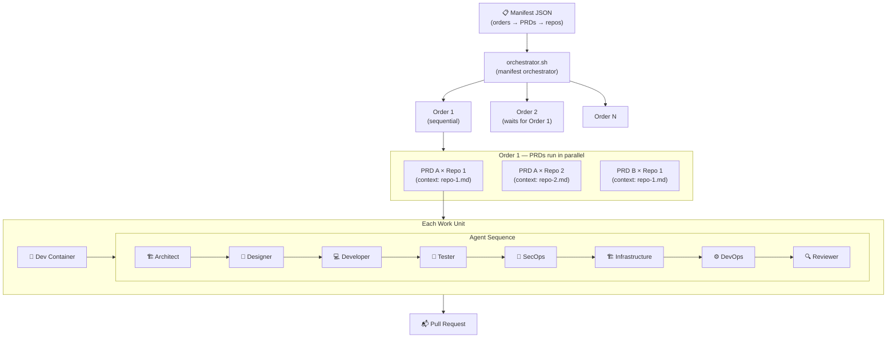
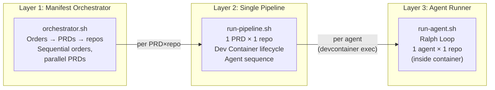
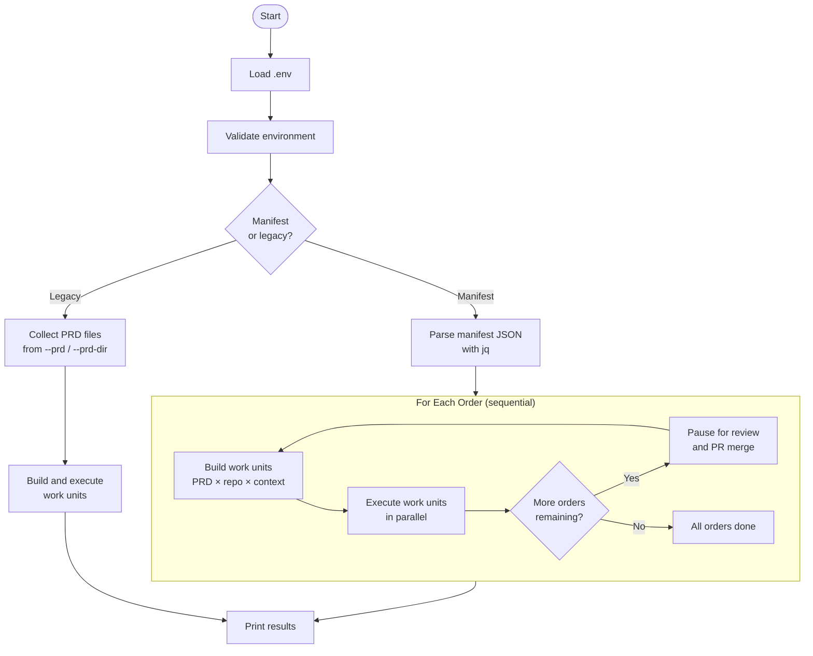
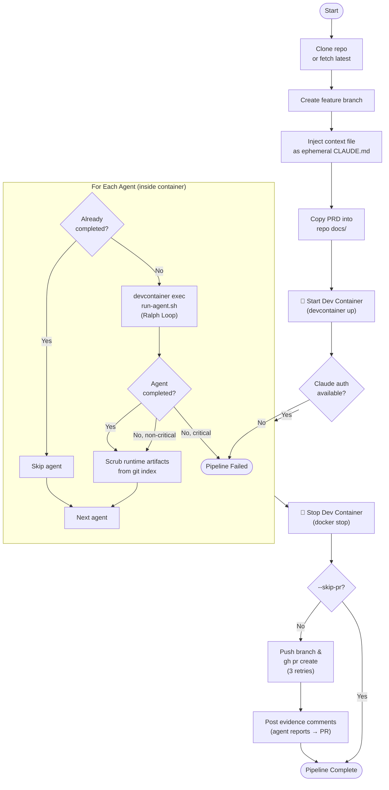
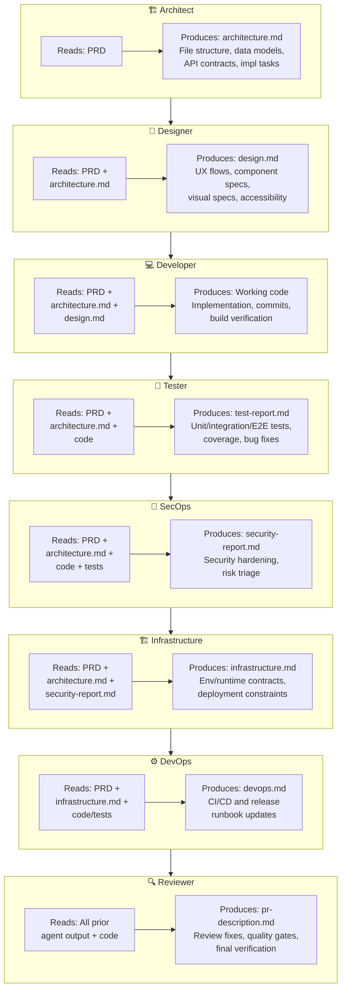
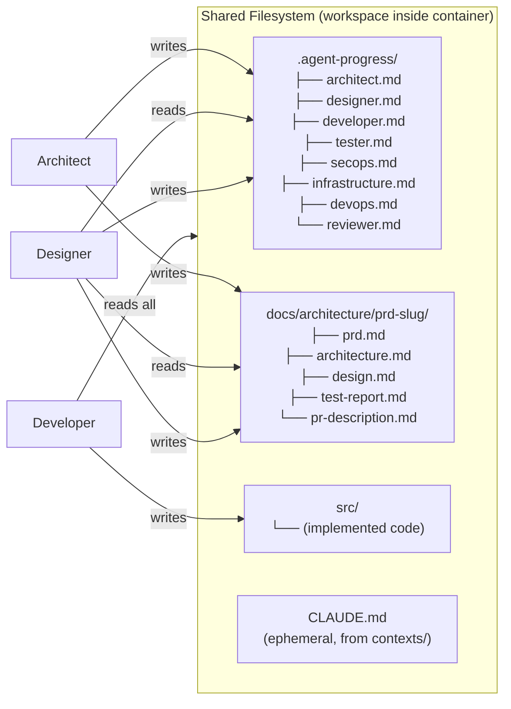

# Pipeline Overview

The Coding Agents Pipeline transforms PRDs into Pull Requests by running specialized AI agents in sequence inside Dev Containers. A **manifest** JSON defines the execution plan: sequential **orders**, each containing **PRDs** that run in parallel, each targeting **repositories** with their own context and branch.

## End-to-End Flow



## Three-Layer Architecture



| Script | Scope | Responsibility |
|--------|-------|---------------|
| `orchestrator.sh` | Manifest → orders → PRDs → repos | Parse manifest, execute orders sequentially, dispatch PRDs in parallel, pause between orders |
| `run-pipeline.sh` | 1 PRD × 1 repo | Clone repo, start Dev Container, inject context, run agents, stop container, create PR |
| `run-agent.sh` | 1 agent | Ralph Loop: build prompt, run Claude Code, check completion |

## Manifest Structure

```json
{
  "name": "Project Name",
  "orders": [
    {
      "name": "1 - Foundation",
      "prds": [
        {
          "prd": "./prds/01-setup.md",
          "repositories": [
            {
              "url": "https://github.com/org/repo",
              "branch": "main",
              "context": "./contexts/repo.md"
            }
          ]
        }
      ]
    }
  ]
}
```

- **Orders** execute sequentially — merge PRs from order N before order N+1 starts
- **PRDs within an order** execute in parallel
- Each **repository** has its own context file, branch, and URL
- **Context** is per-repo (injected as ephemeral `CLAUDE.md`, never committed)

## Orchestrator Lifecycle



## Single Pipeline Lifecycle (run-pipeline.sh)



### Dev Container Execution Notes

- `run-pipeline.sh` starts the container with `.devcontainer/agent/devcontainer.json`.
- Per-agent `devcontainer exec` uses that same config file, so target repos do not need their own `.devcontainer/devcontainer.json`.
- Pipeline logs are written to the repository root `logs/` directory by default.
- Agent commit identity is propagated from host git config (`user.name` / `user.email`) into container execution.
- Agent runtime logs inside containers are written under `.pipeline/logs` (excluded from git), not the target repo `logs/`.
- Per-agent progress files are cleared at the start of each PRD run to avoid cross-PRD completion leakage.
- Agent model is resolved per step: `<AGENT_NAME>_MODEL` override first, then `CLAUDE_MODEL`.
- **Runtime artifact protection**: `.agent-progress/`, `logs/`, `.pipeline/`, and `CLAUDE.md` are excluded from git via `.git/info/exclude`. After each agent finishes, the pipeline scrubs these paths from the git index in case an agent committed them accidentally.
- **PRD working branch**: The feature branch name is read from the PRD's `**Working Branch**` metadata field (e.g. `delehner/01-foundation`). If not declared, falls back to auto-generation from the PRD title.
- **PR evidence comments**: After PR creation, agent reports (tester, secops, infrastructure, devops) are posted as PR comments. Configurable via `--evidence-agents` or `EVIDENCE_AGENTS` env var.
- **Mandatory PR creation**: PR creation retries up to 3 times. If all attempts fail, the pipeline exits with an error. Use `--skip-pr` only for local testing.

## Agent Responsibilities



## Context Passing Between Agents

Agents don't communicate directly. Each agent writes artifacts to disk, and subsequent agents read them:



## CLI Reference

```bash
# Manifest mode (recommended)
./pipeline/orchestrator.sh --manifest ./manifests/my-project.json
./pipeline/orchestrator.sh --manifest ./manifests/my-project.json --order 1
./pipeline/orchestrator.sh --manifest ./manifests/my-project.json --auto

# Legacy mode (single PRD)
./pipeline/orchestrator.sh --prd ./prds/feature.md --repo <url> --context ./contexts/repo.md

# Direct single pipeline (no orchestrator)
./pipeline/run-pipeline.sh --prd <path> --repo <url> --context <path>

# Single agent
./pipeline/run-agent.sh --agent <name> --workdir <path> --prd <path>
```

### Orchestrator Options

| Option | Description | Default |
|--------|-------------|---------|
| `--manifest <path>` | Manifest JSON file | — |
| `--order <n>` | Run only the nth order (1-based) | All orders |
| `--auto` | Skip confirmation prompts between orders | Interactive |
| `--prd <path>` | Legacy: PRD file (repeatable) | — |
| `--prd-dir <dir>` | Legacy: directory of PRD files | — |
| `--repo <url>` | Override repo for all PRDs | From manifest |
| `--branch <name>` | Override branch for all PRDs | From manifest |
| `--agents <list>` | Comma-separated agent list | architect,designer,developer,tester,secops,infrastructure,devops,reviewer |
| `--sequential` | Run work units one at a time | Parallel |
| `--max-parallel <n>` | Max concurrent pipelines | 4 |
| `--skip-pr` | Don't create PRs | false |
| `--no-devcontainer` | Run on host instead of in containers | false |
| `--no-context-update` | Don't update CLAUDE.md after agents | false |
| `--model <name>` | Default Claude model | sonnet |
| `--max-iterations <n>` | Per-agent iteration cap | 10 |
| `--evidence-agents <list>` | Agents whose reports are posted as PR comments | tester,secops,infrastructure,devops |
