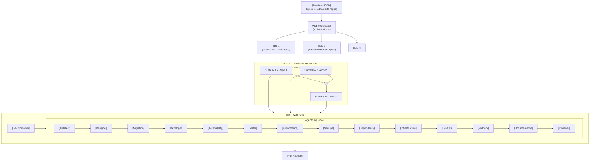
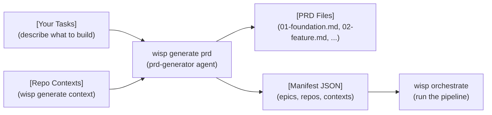
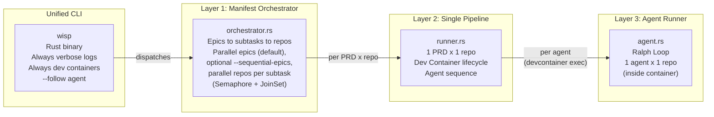
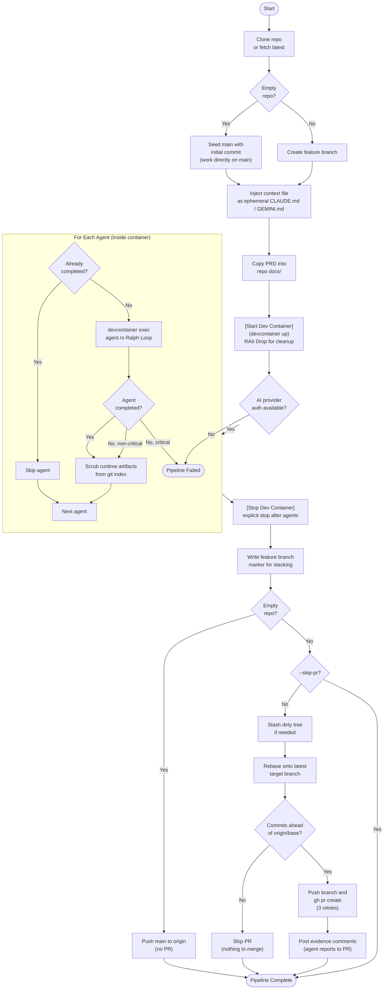
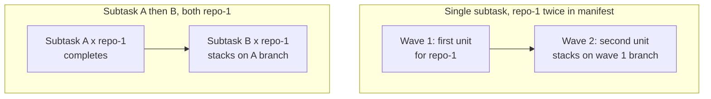
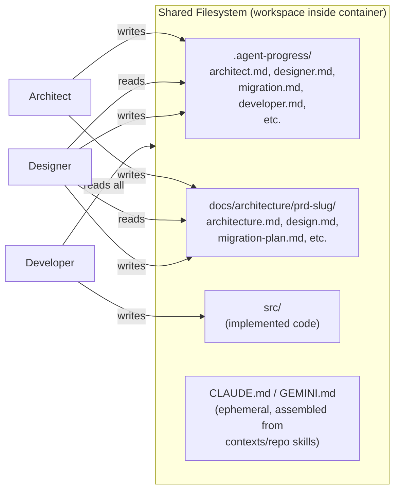

# Pipeline Overview

The Wisp pipeline transforms PRDs into Pull Requests by running specialized AI agents in sequence inside Dev Containers. It supports **Claude Code** and **Gemini CLI** as AI providers (select via `AI_PROVIDER` env var or `wisp --provider <name>`). A **manifest** JSON defines the execution plan: **epics run in parallel by default** when more than one epic is executed, with isolated clone roots under `{PIPELINE_WORK_DIR}/epics/{index}/` so concurrent epics do not corrupt the same checkout. Use **`--sequential-epics`** to run epics one after another on the shared `PIPELINE_WORK_DIR`. Within each epic, **subtasks** (PRD entries) run **in manifest order** (one finishes before the next starts). For a single subtask, **repositories** are still dispatched in parallel (subject to `--max-parallel`), with automatic stacking when the same repo appears more than once in that subtask or across consecutive subtasks in the epic. Legacy manifest keys `orders` / `prds` remain accepted.

The pipeline is implemented as a single **Rust binary** (`wisp`) built with Cargo. All logic lives in Rust modules—no bash scripts. Manifest parsing uses `serde_json`, parallel execution uses tokio `Semaphore` + `JoinSet`, and Dev Container lifecycle uses RAII (`Drop` impl) for cleanup.

## End-to-End Flow



## Pre-Pipeline: PRD Generation

Before running the pipeline, generate PRDs and a manifest using `wisp generate prd`. The command prompts you to describe what you want built directly in the terminal, then uses the `prd-generator` agent with repo contexts to decompose your description into ordered, pipeline-ready PRDs.



The typical workflow is:
1. `wisp generate context` — analyze repos, produce context skills
2. `wisp generate prd` — describe what you want built, produce PRDs and a manifest
3. `wisp orchestrate` — execute the manifest (agents process each PRD)

## Architecture



| Component | Scope | Responsibility |
|-----------|-------|----------------|
| `wisp` | All operations | Unified CLI: single Rust executable, enforces verbose logs + dev containers, `--provider` for AI selection |
| `src/pipeline/orchestrator.rs` | Manifest → epics → subtasks → repos | Parse manifest (serde_json), run multiple epics in parallel by default (`JoinSet` + per-epic workdir), optional `--sequential-epics`, run subtasks in list order within each epic, parallelize repo work units per subtask (shared `Semaphore` cap) |
| `src/pipeline/runner.rs` | 1 PRD × 1 repo | Clone repo, start Dev Container (RAII Drop), inject context, run agents, create PR |
| `src/pipeline/agent.rs` | 1 agent | Ralph Loop: build prompt, run AI agent (Claude or Gemini via `src/provider/`), check completion |
| `src/provider/` | AI execution | Provider abstraction: Claude Code + Gemini CLI (CLI flags, auth, output formats) |
| `src/logging/formatter.rs` | Log output | Verbose log formatting (replaces bash+jq stream-json) |
| `src/pipeline/devcontainer.rs` | Container lifecycle | Dev Container start/stop with RAII cleanup on Drop |

## Manifest Structure

```json
{
  "name": "Project Name",
  "epics": [
    {
      "name": "1 - Foundation",
      "subtasks": [
        {
          "prd": "./prds/01-setup.md",
          "agents": ["architect", "designer"],
          "repositories": [
            {
              "url": "https://github.com/org/repo",
              "branch": "main",
              "context": "./contexts/repo",
              "agents": ["developer", "tester", "reviewer"]
            }
          ]
        }
      ]
    }
  ]
}
```

- **Epics** execute **in parallel by default** when more than one epic runs (each epic uses `{PIPELINE_WORK_DIR}/epics/{index}/` for clones). Use **`--sequential-epics`** to run epics one after another on the shared workdir. **`--sequential`** also disables parallel epics and forces a single pipeline at a time (no parallel repo work units within a subtask)
- **Subtasks within an epic** execute **in manifest order** (the next subtask starts after the previous one’s work units complete). **Repositories** listed under the same subtask still run **in parallel** (within the global concurrency limit). When the same repo appears multiple times **in one subtask**, work is split into **stacking waves**; when the same repo appears again in a **later subtask** in that epic, the next run **stacks** on the previous subtask’s feature branch (see below)
- Each **repository** has its own context file, branch, and URL
- **Context** is per-repo — either a directory of skill files (recommended) or a single file. Assembled into ephemeral `CLAUDE.md` (Claude) or `GEMINI.md` (Gemini) at runtime, never committed
- **Agents** can be specified at the PRD level and/or the repository level (see below)

### Per-Unit Agent Selection

Agents can be configured at two levels in the manifest. They combine (not override):

| Level | Key | Scope |
|-------|-----|-------|
| PRD-level `agents` | `epics[].subtasks[].agents` | Runs for every repository in that subtask |
| Repo-level `agents` | `epics[].subtasks[].repositories[].agents` | Runs only for that specific repository |

The final agent list for a work unit is: **PRD agents first, then repo agents** — matching the natural flow (design before implementation). If neither level specifies agents, the global `--agents` CLI flag (or built-in default) applies.

**Example:** Given `"agents": ["architect"]` on the PRD and `"agents": ["developer", "tester"]` on a repo, that repo runs: architect, developer, tester.

## Orchestrator Lifecycle

```mermaid
flowchart TD
    Start([Start]) --> LoadEnv[Load .env]
    LoadEnv --> Validate[Validate environment]
    Validate --> Mode{Manifest\nor legacy?}

    Mode -->|Manifest| ParseManifest[Parse manifest JSON\nwith serde_json]
    Mode -->|Legacy| CollectPRDs[Collect PRD files\nfrom --prd / --prd-dir]

    ParseManifest --> EpicLoop

    subgraph EpicLoop["Epics parallel (default);\noptional sequential epics;\ninside each epic: next subtask after previous"]
        Spawn[JoinSet for epics\n(or one at a time if --sequential-epics)]
        Spawn --> PerEpic[Per epic: loop subtasks\nsequentially]
        PerEpic --> BuildUnits[Build units for\ncurrent subtask only]
        BuildUnits --> SameRepo{Same repo\nmultiple times\nin this subtask?}
        SameRepo -->|No| Execute[Execute units\nin parallel via JoinSet]
        SameRepo -->|Yes| Waves["Waves: stack within\nthis subtask"]
        Execute --> NextSubtask{Another subtask\nin this epic?}
        Waves --> NextSubtask
        NextSubtask -->|Yes| BuildUnits
        NextSubtask -->|No| EpicTaskDone[Epic task done]
    end

    CollectPRDs --> LegacyExec[Build and execute\nwork units]

    EpicLoop --> Summary[Print results]
    LegacyExec --> Summary
```

## Single Pipeline Lifecycle (wisp pipeline)



### Dev Container Execution Notes

- `runner.rs` uses `.devcontainer/agent/devcontainer.json` from the **cloned repo** (target repos do not need their own `.devcontainer/devcontainer.json` at the repo root for editing, but the clone must contain that agent config—typically from the Wisp template or the project you orchestrate).
- **Provider CLIs run inside the container:** `claude` / `gemini` are invoked via `devcontainer exec --workspace-folder <clone> --config .devcontainer/agent/devcontainer.json -- …` with streaming JSONL (same log formatting as host mode). The `--config` path must match `devcontainer up`; without it, the Dev Containers CLI can report **Dev container not found** even after a successful `up`. Prompt paths are rewritten from the host checkout path to the container workspace path (e.g. `/workspaces/<repo>`). **Agent instructions** in the assembled prompt name the container’s `remoteWorkspaceFolder` as the repository root for Write/Edit/Bash so tools do not write under the host path (e.g. `/tmp/...`), which is not the bind-mounted clone — that mismatch previously caused Ralph stalls when `.agent-progress/` never updated on the host.
- **Headless stdin:** Wisp runs the provider with **no stdin** (equivalent to `< /dev/null`), including on the host when Dev Containers are disabled. That avoids Claude Code waiting on a TTY or emitting “no stdin data received” in non-interactive orchestration; prompts use `-p` / inline text only.
- **Default isolation:** a **fresh** `devcontainer up` for **each agent** in the pipeline, then `stop`/`rm` after that agent’s Ralph loop finishes (all iterations of that agent share one container so `--resume` stays valid). The git worktree is bind-mounted, so commits and files persist across agent boundaries.
- **`--reuse-devcontainer` / `WISP_REUSE_DEVCONTAINER`:** opt into **one** `devcontainer up` for the entire agent sequence (faster, less isolation between agents).
- **Parallel `devcontainer up`:** Wisp serializes `devcontainer up` inside a single process so concurrent epics do not race the Dev Containers CLI when downloading the same OCI features (`ghcr.io/devcontainers/features/*`). Without that, you may see `TAR_BAD_ARCHIVE` / “Failed to download package”. If errors persist, retry once, check network/proxy to GHCR, or clear the CLI’s feature cache; `--sequential-epics` also reduces overlap with anything outside Wisp.
- Dev Container lifecycle: `runner` always stops containers on the success path; per-agent containers are stopped after each agent; a reused container is stopped after the sequence. The `Drop` impl only warns if `stop()` was never called (e.g. panic before cleanup).
- Agent session logs (JSONL / `.log`) go to **`LOG_DIR`** (default `./logs` relative to the **process working directory** where you invoke `wisp`, not the cloned repo). If every agent is skipped as “already completed,” no log files are created for those agents.
- **Provider exits with code 1 (no stderr):** Claude Code often reports failures only on **JSONL stdout**. On non-zero exit, Wisp logs the JSONL path plus a **tail preview** and loose **error hints** in the trace; for Claude **“not logged in”** or **`rate_limit` / “You've hit your limit”** in that stream, the pipeline **fails immediately** with an actionable message instead of a Ralph stall (unchanged progress files are not treated as the root cause). For container auth and `CLAUDE_CODE_OAUTH_TOKEN`, see [prerequisites — Authentication, Dev Containers](prerequisites.md#dev-containers-wisp-agent-container). You can also open `./logs/<run-dir>/architect_iteration_*.jsonl` (path is printed when the pipeline starts).
- **Auth inside the agent container:** `containerEnv` in [`.devcontainer/agent/devcontainer.json`](.devcontainer/agent/devcontainer.json) uses `${localEnv:ANTHROPIC_API_KEY}` and `${localEnv:CLAUDE_CODE_OAUTH_TOKEN}`. Those resolve from the **environment of the process that runs `devcontainer`** (the same shell that launches `wisp`). Ensure keys are exported or present in `.env` loaded before `wisp` runs. If the container was first created when keys were **missing**, run a fresh `devcontainer up` (or remove the old container) so `containerEnv` picks up current values.
- Agent commit identity is propagated from host git config (`user.name` / `user.email`) into container execution.
- Agent runtime logs inside containers are written under `.pipeline/logs` (excluded from git), not the target repo `logs/`.
- Per-agent progress files are cleared at the start of each PRD run to avoid cross-PRD completion leakage.
- Agent model is resolved per step: `<AGENT_NAME>_MODEL` override first, then provider-specific default (`CLAUDE_MODEL` or `GEMINI_MODEL`).
- **Runtime artifact protection**: `.agent-progress/`, `logs/`, and `.pipeline/` are appended to `.git/info/exclude` in the clone so they stay untracked. If the repo tracks `CLAUDE.md` / `GEMINI.md` at the root, assembling context still dirties the tree; **before creating or checking out the feature branch** (and again **before rebase**), any local modifications are **stashed** (including **untracked** files, so `git checkout` for the next PRD/subtask or epic on a reused workdir is not blocked by stray `docs/...` paths), then **`git stash pop`** restores them after branch setup and again after the PR is created or after skipping PR when there is nothing to merge. If **`git stash pop` fails** (merge conflicts), fix or reset the workdir before the next manifest subtask: a conflicted tree can block `git checkout` to the next PRD’s branch, which previously could leave `HEAD` on the prior feature branch and open a duplicate PR for the wrong change set. The pipeline now **fails fast** on checkout errors and **refuses `gh pr create`** unless `HEAD` matches the PRD’s feature branch; it also **re-checks out** that branch immediately before rebase/PR.
- **No PR / no push**: A PR is only opened when `origin/<base>..HEAD` has at least one commit. Normally **`git push` runs as part of PR creation** — so if agents never committed (e.g. only updated `.agent-progress/` and marked `COMPLETED`), you will see “no commits ahead … skipping PR” and no remote branch. **Orchestrated stacked runs are an exception:** when another **wave** (same repo twice in one subtask) or a **later epic subtask** will stack on this repo, Wisp **pushes the feature branch** even with zero commits so `origin/<branch>` exists for the child. Otherwise ensure agents follow `_base-system.md` / developer prompts and commit real changes.
- **PRD working branch**: The feature branch name is read from the PRD's `**Working Branch**` metadata field (e.g. `delehner/01-foundation`). If not declared, falls back to auto-generation from the PRD title.
- **Feature branch start point**: New non-stacked branches are created from `origin/<base branch>` so each PRD starts cleanly from the configured base. Stacked work (waves within one subtask, or a later subtask on the same repo in the epic) branches from the previous feature branch for that repo.
- **Stacked PR base on `origin`**: After checking out the feature branch, the pipeline checks the remote with `git ls-remote --heads origin <stack-base>` **before agents run** (unless `--skip-pr`), so a missing parent branch fails fast. The same requirement applies again before rebase and PR. If the parent stacked branch was never pushed (e.g. `--skip-pr` on the parent, or a run from before the “push for downstream stack” behavior), push that branch or merge its PR first — otherwise rebase and `gh pr create --base` cannot succeed.
- **Push behind remote**: If `git push` is rejected as non-fast-forward (e.g. the branch was updated on GitHub from another machine or an earlier run), Wisp fetches `origin/<head>`, rebases the feature branch onto it, and retries the push once.
- **PR evidence comments**: After PR creation, agent reports (tester, performance, secops, dependency, infrastructure, devops) are posted as PR comments. Configurable via `--evidence-agents` or `EVIDENCE_AGENTS` env var.
- **Mandatory PR creation**: PR creation retries up to 3 times. If all attempts fail, the pipeline exits with an error. Use `--skip-pr` only for local testing.
- **Empty repository handling**: When the target repo has no branches (virgin repo), the pipeline seeds `main` with an initial commit and works directly on it — no feature branch, no PR. The finished `main` is pushed to origin at the end. This avoids the impossible "PR to a branch that doesn't exist" scenario.

## Conflict Prevention

Two mechanisms prevent merge conflicts when multiple PRDs target the same repository:

### Rebase Before PR

Before pushing and creating a PR, the pipeline rebases the feature branch onto the latest target branch. This catches changes from previously merged PRs (cross-epic) and external commits. If the rebase fails due to true conflicts, it is aborted and the PR is created anyway — the user resolves the conflict on GitHub.

### Stacked Branches (Same Repo)

Two cases:

1. **Same repo listed multiple times under one subtask** — the orchestrator groups units by repo URL and runs **waves**: wave 1 is one unit per distinct repo (in parallel across repos); wave 2+ stacks on the previous wave’s feature branch for that repo (`--stack-on`).

2. **Same repo in consecutive subtasks within an epic** — Subtasks run in list order, so the earlier subtask finishes first. The next subtask’s pipeline for that repo stacks on the **previous subtask’s** working branch (read from PRD metadata after the first run completes).



- PRs can be chained so a stacked branch targets the previous feature branch instead of `main`; when the base PR merges, GitHub can auto-retarget follow-up PRs.

This is automatic — no manifest changes needed. Different repos under the same subtask still run in parallel (within `--max-parallel`).

## Agent Responsibilities

```mermaid
flowchart TD
    subgraph Architect["[Architect]"]
        A_In[Reads: PRD] --> A_Out[Produces: architecture.md\nFile structure, data models,\nAPI contracts, impl tasks]
    end

    subgraph Designer["[Designer]"]
        D_In[Reads: PRD +\narchitecture.md] --> D_Out[Produces: design.md\nUX flows, component specs,\nvisual specs, accessibility]
    end

    subgraph Migration["[Migration]"]
        Mig_In[Reads: PRD +\narchitecture.md] --> Mig_Out[Produces: migration-plan.md\nDB migrations, rollback,\ndangerous op mitigation]
    end

    subgraph Developer["[Developer]"]
        Dev_In[Reads: PRD +\narchitecture.md +\ndesign.md] --> Dev_Out[Produces: Working code\nImplementation, commits,\nbuild verification]
    end

    subgraph Accessibility["[Accessibility]"]
        Acc_In[Reads: design.md +\ncode] --> Acc_Out[Produces: accessibility-report.md\nWCAG audit, ARIA fixes,\nkeyboard nav, contrast]
    end

    subgraph Tester["[Tester]"]
        T_In[Reads: PRD +\narchitecture.md +\ncode] --> T_Out[Produces: test-report.md\nUnit/integration/E2E tests,\ncoverage, bug fixes]
    end

    subgraph Performance["[Performance]"]
        Perf_In[Reads: PRD +\ncode + tests] --> Perf_Out[Produces: performance-report.md\nBenchmarks, query analysis,\nbundle size, memory]
    end

    subgraph SecOps["[SecOps]"]
        S_In[Reads: PRD +\narchitecture.md +\ncode + tests] --> S_Out[Produces: security-report.md\nSecurity hardening,\nrisk triage]
    end

    subgraph Dependency["[Dependency]"]
        Dep_In[Reads: code +\nsecurity-report.md] --> Dep_Out[Produces: dependency-report.md\nLicense, vulnerabilities,\nmaintenance health]
    end

    subgraph Infrastructure["[Infrastructure]"]
        I_In[Reads: PRD +\narchitecture.md +\nsecurity-report.md] --> I_Out[Produces: infrastructure.md\nEnv/runtime contracts,\ndeployment constraints]
    end

    subgraph DevOps["[DevOps]"]
        O_In[Reads: PRD +\ninfrastructure.md +\ncode/tests] --> O_Out[Produces: devops.md\nCI/CD and release\nrunbook updates]
    end

    subgraph Rollback["[Rollback]"]
        Rb_In[Reads: migration-plan +\ninfrastructure.md +\ndevops.md] --> Rb_Out[Produces: rollback-plan.md\nRollback procedures,\nfeature flags, monitoring]
    end

    subgraph Documentation["[Documentation]"]
        Doc_In[Reads: All prior\nagent output + code] --> Doc_Out[Produces: documentation-summary.md\nREADME, API docs,\nchangelog, guides]
    end

    subgraph Reviewer["[Reviewer]"]
        R_In[Reads: All prior\nagent output + code] --> R_Out[Produces: pr-description.md\nReview fixes, quality gates,\nfinal verification]
    end

    Architect --> Designer --> Migration --> Developer --> Accessibility --> Tester --> Performance --> SecOps --> Dependency --> Infrastructure --> DevOps --> Rollback --> Documentation --> Reviewer
```



## Context Passing Between Agents

Agents don't communicate directly. Each agent writes artifacts to disk, and subsequent agents read them:



## Ralph loop iterations & blocking agents

**Iterations** — Each agent run uses a **Ralph loop** (see [`docs/ralph-loop.md`](ralph-loop.md)): after the AI finishes, Wisp checks `.agent-progress/<agent>.md` for a COMPLETED status. If not complete, it runs the same agent again, up to the manifest’s `max_iterations` (or `PIPELINE_MAX_ITERATIONS` / `--max-iterations` if the manifest omits it) and optional per-agent caps in `agent_max_iterations`, then env overrides such as `INFRASTRUCTURE_MAX_ITERATIONS`. Log lines like `iteration=1` / `iteration=2` are **attempts**, not a goal—the agent is supposed to finish in one pass when it updates its progress file correctly. Hitting the max means “still not marked COMPLETED,” not “this agent always needs two rounds.”

**Blocking** — If an agent ends in failure or max iterations without completion, the pipeline **stops** only for **blocking** agents. **Non-blocking** agents log a warning and the next agent runs. Non-blocking set is defined in `src/pipeline/mod.rs` (`NON_BLOCKING_AGENTS`): currently designer, migration, accessibility, performance, dependency, infrastructure, rollback, and documentation. All other agents (architect, developer, tester, secops, devops, reviewer, …) still abort the pipeline on failure or incomplete max iterations.

## Running from VS Code

The Wisp VS Code extension lets you invoke the same CLI subcommands directly from the Command Palette (`Cmd+Shift+P` / `Ctrl+Shift+P`) without switching to a terminal. Each command in the extension maps 1:1 to a `wisp` CLI subcommand — the extension spawns the `wisp` binary as a subprocess, so behavior, output, and configuration are identical to running the command in a terminal.

For example, **Wisp: Show Version** in the Command Palette is equivalent to `wisp --version` on the command line.

See the [VS Code Extension Feature Guide](vscode-extension.md) for all available commands, configuration, and activation details.

## CLI Reference

### Subcommands

| Command | Replaces | Description |
|---------|----------|-------------|
| `wisp orchestrate --manifest <path>` | orchestrator.sh | Run full manifest (epics, subtasks, repos) |
| `wisp pipeline --prd <path> --repo <url>` | run-pipeline.sh | Single PRD × single repo |
| `wisp run --agent <name> --workdir <path> --prd <path>` | run-agent.sh | Single agent (Ralph Loop) |
| `wisp generate prd ...` | generate-prd.sh | Generate PRDs and manifest from description |
| `wisp generate context ...` | generate-context.sh | Generate context skills from repo analysis |
| `wisp monitor` | monitor.sh | Tail agent logs, list sessions |
| `wisp logs <file.jsonl>` | log-formatter.sh | Re-format raw .jsonl log file |
| `wisp install skills` | scripts/install-skills.sh | Install Cursor skills as symlinks |
| `wisp update` | — | Self-update the `wisp` binary |

### Unified CLI (`wisp`)

The `wisp` CLI is a single Rust executable built with Cargo. Install it globally with the install script (see README) or run it from the repo root. It always enables verbose log formatting and always enforces Dev Containers.

```bash
# Generate context skills for a repo
wisp generate context --repo <path-or-url> --output ./contexts/my-repo

# Generate PRDs and a manifest (prompts you to describe your tasks)
wisp generate prd \
  --output ./prds/my-app \
  --manifest ./manifests/my-app.json \
  --repo https://github.com/org/my-repo --context ./contexts/my-repo

# Run a full manifest
wisp orchestrate --manifest ./manifests/my-project.json

# Use Gemini CLI instead of Claude Code
wisp orchestrate --manifest ./manifests/my-project.json --provider gemini

# Interactive mode (pause between agents/iterations)
wisp orchestrate --manifest ./manifests/my-project.json --interactive

# Focus on a specific agent's output
wisp orchestrate --manifest ./manifests/my-project.json --follow developer

# Single PRD × single repo
wisp pipeline --prd <path> --repo <url> --context <path-or-dir>

# Single agent (Ralph Loop)
wisp run --agent <name> --workdir <path> --prd <path>

# Monitor running agents from another terminal
wisp monitor --agent developer
wisp monitor --sessions

# Re-format a raw .jsonl log file
wisp logs ./logs/developer_iteration_1.jsonl

# Install Cursor skills
wisp install skills

# Self-update
wisp update
```

### wisp generate prd Options

| Option | Description | Default |
|--------|-------------|---------|
| `--output <dir>` | Directory to write generated PRDs (required) | — |
| `--manifest <path>` | Path to write manifest JSON (required) | — |
| `--repo <url>` | Repository URL (repeatable, starts a new repo entry) | — |
| `--context <path>` | Context directory or file for the preceding `--repo` | — |
| `--description <text>` | Project description (what to build). If omitted, prompts interactively or reads from stdin | — |
| `--branch <name>` | Base branch for the preceding `--repo` | main |
| `--name <text>` | Project name for the manifest | From output dir name |
| `--author <slug>` | Author slug for PRD metadata and branch names | From git config |
| `--model <name>` | AI model (default depends on provider: sonnet for Claude, gemini-2.5-pro for Gemini) | Provider default |
| `--max-iterations <n>` | Max Ralph Loop iterations | 5 |
| `--quiet` | Suppress detailed streaming (text-only output) | Verbose (stream-json) |
| `--interactive` | Pause between iterations for review and course correction | false |

### wisp orchestrate Options

| Option | Description | Default |
|--------|-------------|---------|
| `--manifest <path>` | Manifest JSON file | — |
| `--provider <name>` | AI provider: `claude` or `gemini` (also via `AI_PROVIDER` env var) | claude |
| `--epic <n>` | Run only the nth epic (1-based); `--order` is an alias | All epics |
| `--auto` | Skip confirmation prompts between epics | Interactive |
| `--prd <path>` | Legacy: PRD file (repeatable) | — |
| `--prd-dir <dir>` | Legacy: directory of PRD files | — |
| `--repo <url>` | Override repo for all PRDs | From manifest |
| `--branch <name>` | Override branch for all PRDs | From manifest |
| `--agents <list>` | Comma-separated agent list (global fallback; overridden by per-PRD/per-repo agents in manifest) | architect,designer,migration,developer,accessibility,tester,performance,secops,dependency,infrastructure,devops,rollback,documentation,reviewer |
| `--sequential` | Run epics sequentially and every pipeline strictly serial | Sequential epics; parallel repos per subtask when multiple repos under one subtask |
| `--sequential-epics` | Run manifest epics one after another (shared workdir) | false (epics parallel by default with isolated `{work_dir}/epics/{index}/`) |
| `--max-parallel <n>` | Max concurrent `runner` pipelines **across all epics** (only matters when work units run in parallel) | 4 |
| `--skip-pr` | Don't create PRs | false |
| `--no-devcontainer` | Run provider CLI on host instead of `devcontainer exec` | false |
| `--reuse-devcontainer` | One `devcontainer up` for all agents in each pipeline (also `WISP_REUSE_DEVCONTAINER`) | false |
| `--no-context-update` | Don't update context file (CLAUDE.md/GEMINI.md) after agents | false |
| `--model <name>` | Default AI model (provider-specific: sonnet for Claude, gemini-2.5-pro for Gemini) | Provider default |
| `--max-iterations <n>` | Per-agent iteration cap | 10 |
| `--evidence-agents <list>` | Agents whose reports are posted as PR comments | tester,performance,secops,dependency,infrastructure,devops |
| `--verbose-logs` | Enable detailed logging (thinking, tool calls, results) | false |
| `--interactive` | Pause between agents and iterations for review | false |

### wisp pipeline Options

| Option | Description | Default |
|--------|-------------|---------|
| `--stack-on <branch>` | Stack this branch on a previous feature branch (used by orchestrator for same-repo stacking) | — |
| `--no-devcontainer` | Run provider CLI on host instead of `devcontainer exec` | false |
| `--reuse-devcontainer` | One `devcontainer up` for all agents (also `WISP_REUSE_DEVCONTAINER`) | false |
| `--verbose-logs` | Enable detailed logging (thinking, tool calls, results) | false |
| `--interactive` | Pause between agents for review and course correction | false |

### Monitoring

| Command | Description |
|---------|-------------|
| `wisp monitor` | Tail all agent logs in real-time |
| `wisp monitor --agent <name>` | Tail logs for a specific agent |
| `wisp monitor --sessions` | List available session IDs for resumption |
| `wisp logs <file.jsonl>` | Re-format a raw .jsonl log file for reading |
| `claude --resume <session-id>` | Resume a Claude agent session interactively |
| `gemini --resume <session-id>` | Resume a Gemini agent session interactively |

### wisp CLI Options

| Option | Applies to | Description |
|--------|-----------|-------------|
| `--follow <agent>` | `orchestrate`, `pipeline` | Focus output on a specific agent |
| `--provider <name>` | All commands | AI provider: `claude` (default) or `gemini` |

The `wisp` CLI always injects `--verbose-logs` and blocks `--no-devcontainer`. All other flags are passed through to the underlying commands. Provider can also be set via `AI_PROVIDER` env var.
