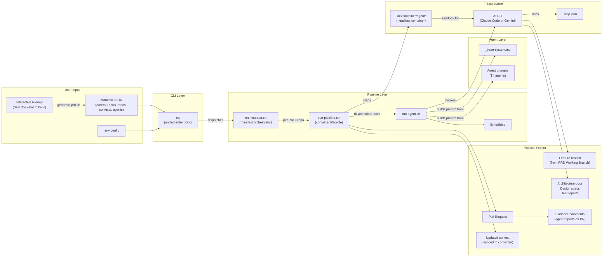

# Project Structure

Complete reference for the repository layout and how each component connects.

## Directory Map

```mermaid
flowchart TD
    Root["coding-agents/"]

    Root --> CA["ca\nUnified CLI entry point"]
    Root --> Scripts["scripts/\nInstallation & setup scripts"]
    Root --> Pipeline["pipeline/\nOrchestrator & Ralph Loop scripts"]
    Root --> Agents["agents/\nAgent prompt definitions"]
    Root --> Manifests["manifests/\nExecution plans (orders + PRDs + repos)"]
    Root --> PRDs["prds/\nProduct Requirements Documents"]
    Root --> Contexts["contexts/\nPer-repo context skill directories"]
    Root --> Templates["templates/\nManifest, PRD & context templates"]
    Root --> Skills["skills/\nCursor-compatible skills"]
    Root --> DevC[".devcontainer/\nDev Container configs"]
    Root --> Docs["docs/\nProject documentation"]
    Root --> Config["config/\nSettings templates"]

    Pipeline --> POrch["orchestrator.sh\n(manifest orchestrator)"]
    Pipeline --> PPipe["run-pipeline.sh\n(single PRD × repo + container)"]
    Pipeline --> PRun["run-agent.sh\n(Ralph Loop)"]
    Pipeline --> PGen["generate-context.sh\n(context skill generator)"]
    Pipeline --> PPrd["generate-prd.sh\n(PRD & manifest generator)"]
    Pipeline --> PMon["monitor.sh\n(real-time log monitor)"]
    Pipeline --> PLib["lib/\nprogress.sh\ngit-utils.sh\nvalidation.sh\nprd-parser.sh\nprovider.sh\ncontext.sh\nlog-formatter.sh"]

    Agents --> ABase["_base-system.md"]
    Agents --> AArch["architect/prompt.md"]
    Agents --> ADes["designer/prompt.md"]
    Agents --> AMig["migration/prompt.md"]
    Agents --> ADev["developer/prompt.md"]
    Agents --> AAcc["accessibility/prompt.md"]
    Agents --> ATest["tester/prompt.md"]
    Agents --> APerf["performance/prompt.md"]
    Agents --> ASec["secops/prompt.md"]
    Agents --> ADep["dependency/prompt.md"]
    Agents --> AInfra["infrastructure/prompt.md"]
    Agents --> AOps["devops/prompt.md"]
    Agents --> ARb["rollback/prompt.md"]
    Agents --> ADoc["documentation/prompt.md"]
    Agents --> ARev["reviewer/prompt.md"]
    Agents --> ACtx["context-generator/prompt.md"]
    Agents --> APrd["prd-generator/prompt.md"]

    DevC --> DCMain["devcontainer.json\n(for editing this repo)"]
    DevC --> DCAgent["agent/\n(for running agents headlessly)"]

    Templates --> TManifest["manifest.json"]
    Templates --> TPRD["prd.md"]
    Templates --> TCtx["project-context.md\ncontext-skill.md"]
```

## Component Relationships

## File Reference

| File | Purpose | Modified When |
|------|---------|---------------|
| `ca` | Unified CLI: wraps all scripts, enforces verbose logs + dev containers, `--follow` filtering | Adding subcommands, changing CLI defaults |
| `scripts/install.sh` | curl-based installer: clones repo, symlinks `ca` to PATH, checks prerequisites | Changing install path, adding prerequisites |
| `scripts/install-skills.sh` | Installs Cursor skills as symlinks to `~/.cursor/skills/` | Adding/removing skills |
| `pipeline/orchestrator.sh` | Manifest orchestrator: orders, parallel PRDs, per-repo context | Changing execution model, adding manifest features |
| `pipeline/run-pipeline.sh` | Single PRD × single repo: Dev Container lifecycle, agent sequence, PR, repo-root logging | Adding agents, changing container config, flow |
| `pipeline/run-agent.sh` | Ralph Loop implementation, prompt assembly | Changing iteration logic or prompt structure |
| `pipeline/generate-context.sh` | Context skill generator: analyzes repos and produces skill files | Changing context generation workflow |
| `pipeline/generate-prd.sh` | PRD and manifest generator: prompts for a description, uses repo contexts to produce ordered PRDs and a manifest | Changing PRD generation workflow |
| `pipeline/lib/prd-parser.sh` | Parse PRD metadata: status, title, priority, working branch | Changing PRD metadata format |
| `pipeline/lib/provider.sh` | AI provider abstraction: Claude Code vs Gemini CLI, CLI flags, auth, context filename (CLAUDE.md/GEMINI.md) | Adding providers, changing CLI invocation |
| `pipeline/lib/progress.sh` | Read/write `.agent-progress/` files | Changing progress format |
| `pipeline/lib/git-utils.sh` | Clone, branch, rebase, PR creation, PR evidence posting | Changing git workflow |
| `pipeline/lib/validation.sh` | Environment, PRD, and devcontainer validation | Adding new validations |
| `pipeline/lib/context.sh` | Context skill assembly (directory → single CLAUDE.md or GEMINI.md per provider) | Changing context skill format or ordering |
| `pipeline/lib/log-formatter.sh` | Format stream-json events into readable output (thinking, tools, results) | Changing log format or adding new event types |
| `pipeline/monitor.sh` | Real-time log tailing with agent filtering and session listing | Changing monitoring workflow |
| `agents/_base-system.md` | Shared instructions for all agents | Changing universal agent behavior |
| `agents/*/prompt.md` | Per-agent instructions and completion criteria | Modifying agent behavior |
| `manifests/*.json` | Execution plans: orders, PRDs, repos, contexts, per-unit agents | Adding projects or changing execution plans |
| `contexts/<repo>/` | Per-repo context skill directories (assembled into ephemeral CLAUDE.md or GEMINI.md per provider) | Repo conventions change, new repos added |
| `templates/manifest.json` | Manifest template | Changing manifest schema |
| `templates/prd.md` | PRD template for users | Changing required PRD sections |
| `templates/project-context.md` | Legacy single-file context template | Changing project setup workflow |
| `templates/context-skill.md` | Context skill template (directory-based contexts) | Changing context skill format |
| `.devcontainer/devcontainer.json` | Dev Container for editing this repo (VS Code/Cursor) | Changing IDE dev environment |
| `.devcontainer/agent/*` | Dev Container for running agents headlessly (installs both Claude Code and Gemini CLI) | Changing agent sandbox |
| `.mcp.json` | MCP server connections (GitHub, Notion, Figma, Slack) | Adding/removing integrations |
| `.env.example` | Environment variable documentation | Adding new config options |
| `config/settings.json` | Claude Code settings template | Changing default model or permissions |
| `skills/*/SKILL.md` | Cursor agent skills | Adding skills or changing workflows |
| `.cursor/rules/*.mdc` | Cursor rules for maintaining this repo | Changing development conventions |
| `CLAUDE.md` | Claude Code instructions for this repo | Changing project structure or conventions |
| `docs/*.md` | This documentation | Any significant change to the repo |
