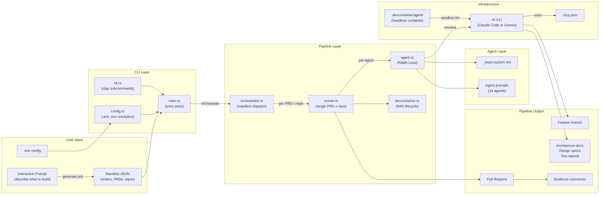

# Project Structure

Complete reference for the repository layout and how each component connects. The pipeline is a **Rust binary** (`wisp`) built with Cargo — no bash scripts.

## Directory Map

```mermaid
flowchart TD
    Root["wisp/"]

    Root --> Cargo["Cargo.toml\nRust project manifest"]
    Root --> Src["src/\nRust source code"]
    Root --> Scripts["scripts/\nBinary installer"]
    Root --> Agents["agents/\nAgent prompt definitions"]
    Root --> Manifests["manifests/\nExecution plans"]
    Root --> PRDs["prds/\nProduct Requirements Documents"]
    Root --> Contexts["contexts/\nPer-repo context skill directories"]
    Root --> Templates["templates/\nPRD, manifest, context templates"]
    Root --> Skills["skills/\nCursor-compatible skills"]
    Root --> DevC[".devcontainer/\nDev Container configs"]
    Root --> Docs["docs/\nDocumentation"]
    Root --> Config["config/\nSettings templates"]
    Root --> Workflows[".github/workflows/\nCI and release"]

    Src --> Main["main.rs\nEntry point, CLI dispatch"]
    Src --> Cli["cli.rs\nclap derive structs"]
    Src --> ConfigRs["config.rs\n.env loading, env resolution"]
    Src --> Utils["utils.rs\nShell exec, path resolution, slugify"]
    Src --> ManifestMod["manifest/mod.rs\nManifest, Order, PrdEntry, Repository"]
    Src --> PrdMod["prd/mod.rs\nPRD struct, metadata extraction"]
    Src --> Provider["provider/\nAI provider abstraction"]
    Src --> Pipeline["pipeline/\nOrchestration, Ralph Loop, Dev Container"]
    Src --> Git["git/\nClone, branch, rebase, PR"]
    Src --> ContextMod["context/mod.rs\nSkill assembly, frontmatter stripping"]
    Src --> Logging["logging/\nTracing, formatter, monitor"]

    Provider --> ProviderMod["mod.rs\nProvider trait"]
    Provider --> Claude["claude.rs\nClaude Code CLI flags"]
    Provider --> Gemini["gemini.rs\nGemini CLI flags"]

    Pipeline --> PipelineMod["mod.rs\nAgent ordering, blocking"]
    Pipeline --> Orchestrator["orchestrator.rs\nManifest dispatch, waves"]
    Pipeline --> Runner["runner.rs\nSingle PRD x repo pipeline"]
    Pipeline --> Agent["agent.rs\nRalph Loop"]
    Pipeline --> Devcontainer["devcontainer.rs\nDev Container lifecycle"]

    Git --> GitMod["mod.rs\nClone, branch, rebase, push"]
    Git --> Pr["pr.rs\ngh pr create, evidence comments"]

    Logging --> LoggingMod["mod.rs\nTracing setup"]
    Logging --> Formatter["formatter.rs\nJSONL stream formatting"]
    Logging --> Monitor["monitor.rs\nReal-time log tailing"]

    Agents --> ABase["_base-system.md"]
    Agents --> APrompts["*/prompt.md\nPer-agent prompts"]

    DevC --> DCMain["devcontainer.json\nFor editing this repo"]
    DevC --> DCAgent["agent/\nFor agent execution"]
    DevC --> InitFirewall["init-firewall.sh\nNetwork firewall"]
    DevC --> PostCreate["post-create.sh"]
    DevC --> PostStart["post-start.sh"]

    Workflows --> CI["ci.yml\nBuild, test, clippy, fmt"]
    Workflows --> Release["release.yml\nCross-compile, GitHub Releases, Homebrew"]
```

## Component Relationships

## Key Dependencies

| Crate | Purpose |
|-------|---------|
| `clap` | CLI argument parsing (derive) |
| `tokio` | Async runtime |
| `serde` / `serde_json` | JSON serialization |
| `anyhow` / `thiserror` | Error handling |
| `tracing` / `tracing-subscriber` | Structured logging |
| `notify` | File watching (monitor) |
| `dialoguer` | Interactive prompts |
| `indicatif` | Progress bars |
| `which` | PATH lookup for AI CLIs |
| `dotenvy` | `.env` loading |

## File Reference

| File | Purpose | Modified When |
|------|---------|---------------|
| `Cargo.toml` | Rust project manifest, dependencies | Adding crates, changing build config |
| `src/main.rs` | Entry point, CLI dispatch, generator commands | Adding subcommands, changing flow |
| `src/cli.rs` | clap derive structs for all subcommands | Adding/removing CLI options |
| `src/config.rs` | `.env` loading, env var resolution, defaults | Adding config options |
| `src/utils.rs` | Shell exec helpers, path resolution, slugify | Changing utility behavior |
| `src/manifest/mod.rs` | Manifest, Order, PrdEntry, Repository structs + serde | Changing manifest schema |
| `src/prd/mod.rs` | PRD struct, metadata extraction (title, status, branch) | Changing PRD metadata format |
| `src/provider/mod.rs` | Provider trait | Adding providers |
| `src/provider/claude.rs` | Claude Code CLI flags, session extraction | Changing Claude invocation |
| `src/provider/gemini.rs` | Gemini CLI flags, session extraction | Changing Gemini invocation |
| `src/pipeline/mod.rs` | Agent ordering, blocking classification | Changing agent sequence |
| `src/pipeline/orchestrator.rs` | Manifest dispatch, wave stacking, parallel execution | Changing orchestration logic |
| `src/pipeline/runner.rs` | Single PRD × repo pipeline | Changing pipeline flow |
| `src/pipeline/agent.rs` | Ralph Loop (prompt assembly, completion detection) | Changing iteration logic |
| `src/pipeline/devcontainer.rs` | Dev Container lifecycle (RAII cleanup) | Changing container behavior |
| `src/git/mod.rs` | Clone, branch, rebase, push | Changing git workflow |
| `src/git/pr.rs` | `gh pr create`, evidence comments | Changing PR creation |
| `src/context/mod.rs` | Skill assembly, frontmatter stripping | Changing context format |
| `src/logging/mod.rs` | Tracing setup | Changing log config |
| `src/logging/formatter.rs` | JSONL stream formatting (Claude + Gemini) | Changing log format |
| `src/logging/monitor.rs` | Real-time log tailing (notify-based) | Changing monitoring |
| `scripts/install.sh` | Binary download installer (GitHub Releases) | Changing install path, platforms |
| `agents/_base-system.md` | Shared instructions for all agents | Changing universal agent behavior |
| `agents/*/prompt.md` | Per-agent instructions and completion criteria | Modifying agent behavior |
| `manifests/*.json` | Execution plans: orders, PRDs, repos, contexts | Adding projects or changing plans |
| `prds/<project>/` | Product Requirements Documents (referenced by manifests) | Adding or editing PRDs |
| `contexts/<repo>/` | Per-repo context skill directories | Repo conventions change |
| `templates/manifest.json` | Manifest template | Changing manifest schema |
| `templates/prd.md` | PRD template | Changing required PRD sections |
| `templates/context-skill.md` | Context skill template | Changing context skill format |
| `.devcontainer/devcontainer.json` | Dev Container for editing this repo | Changing IDE dev environment |
| `.devcontainer/agent/*` | Dev Container for running agents headlessly | Changing agent sandbox |
| `.devcontainer/init-firewall.sh` | Network firewall (only remaining shell script) | Changing firewall rules |
| `.devcontainer/post-create.sh` | Container setup hook | Changing container setup |
| `.devcontainer/post-start.sh` | Container start hook | Changing container startup |
| `.github/workflows/ci.yml` | Build, test, clippy, fmt | Changing CI steps |
| `.github/workflows/release.yml` | Cross-compile, GitHub Releases, Homebrew | Changing release process |
| `.mcp.json` | MCP server connections | Adding/removing integrations |
| `.env.example` | Environment variable reference | Adding new config options |
| `config/settings.json` | AI CLI settings template | Changing default model |
| `skills/*/SKILL.md` | Cursor agent skills | Adding skills or changing workflows |
| `CLAUDE.md` | Claude Code instructions for this repo | Changing project conventions |
| `docs/*.md` | This documentation | Any significant change |
