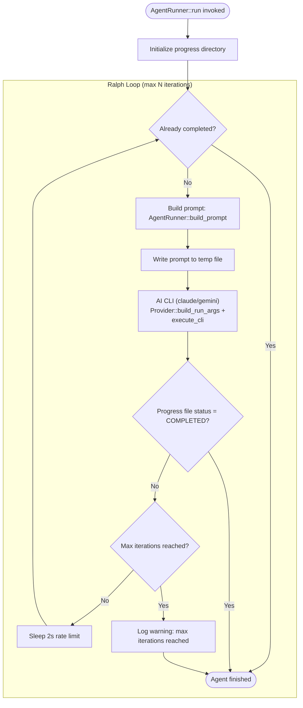
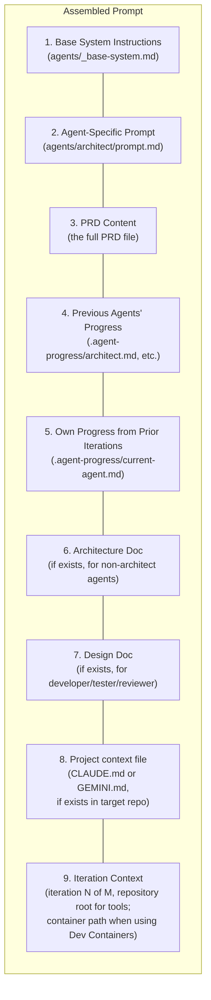
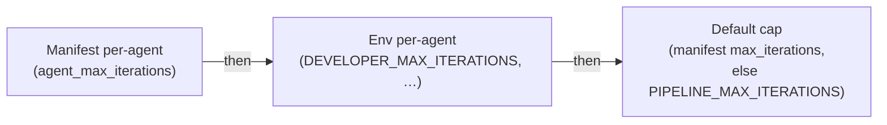

# Ralph Loop Mechanism

A Ralph Loop wraps an AI agent (Claude Code or Gemini CLI) in an iterative execution cycle. Each iteration gets a fresh context window, with progress persisted to the filesystem between iterations. This overcomes context window limits and allows self-correction. The pipeline's provider abstraction (`src/provider/mod.rs`, `Provider` trait) handles CLI-specific flags, auth, and output formats for each provider.

## How It Works



## Why Ralph Loops Work

### Session resume after iteration 1
Iteration **1** runs `claude -p <assembled-prompt.md>` (or `gemini` equivalent) as a **new** session — the prompt is still a **path** (large assembled markdown). Iterations **2+** run with **`--resume <session_id>`** and pass the continuation as **inline `-p` text** (`RunOpts.prompt_inline`), not a path, so the model cannot satisfy the turn by only `Read`-ing `.pipeline/prompt-*.md`.

Without resume, each iteration was a **new** session given only the prompt path; models often issued a single `Read` on that file and stopped — producing identical-looking logs and no progress toward `## Status: COMPLETED`.

### Stall detection
If `.agent-progress/<agent>.md` is **unchanged** (after normalizing whitespace) for **two consecutive iterations**, the loop returns **failed** with a clear `Ralph stall` message instead of running until the hard iteration cap. That stops token burn when the model never updates its progress file. **Provider hard failures** (e.g. Claude JSONL `not logged in` or `rate_limit`) are detected on non-zero CLI exit and fail immediately with a dedicated message so they are not mislabeled as a stall.

### Filesystem as Memory
Progress, decisions, and artifacts are written to `.agent-progress/<agent>.md` and `docs/architecture/`. Each iteration reads this file to understand what's already been done.

At pipeline start for a new PRD, previous `.agent-progress/*.md` files are cleared to ensure each PRD executes a fresh Architect → Reviewer sequence.

### Self-Correction
If an iteration produces incorrect code or misses a task, the next iteration sees the current state (including failing tests or incomplete tasks) and can correct course.

## Prompt Assembly Per Iteration

The prompt is assembled in `AgentRunner::build_prompt()` from multiple sources, layered in this order:



## Completion Detection

An agent is considered `COMPLETED` when its progress file contains:

```markdown
## Status: COMPLETED
```

The `AgentRunner::is_completed()` method in `src/pipeline/agent.rs` checks `.agent-progress/<agent>.md` for this status. If the status is `COMPLETED` at the start of an iteration, the loop exits immediately.

If the file contains `## Status: BLOCKED`, the run stops with a failure outcome (blocking agents abort the pipeline; non-blocking agents log a warning and the pipeline may continue).

## Iteration Limits

For **`wisp orchestrate`**, each pipeline run gets a default cap and optional per-agent caps from the **manifest** (`max_iterations`, `agent_max_iterations` in the manifest JSON). The runner then resolves each agent in `src/pipeline/runner.rs`:

1. **Manifest** per-agent value (`agent_max_iterations.<agent>`), if set  
2. Else **environment** per-agent override (e.g. `DEVELOPER_MAX_ITERATIONS`)  
3. Else the manifest default **`max_iterations`**, or if the manifest omits it, **`PIPELINE_MAX_ITERATIONS` / `--max-iterations`** from config  

For **`wisp pipeline`** and **`wisp run`**, only config (env + CLI flags) applies — there is no manifest.

### Blocking agents and the hard cap

**Blocking** agents (everyone except designer, migration, accessibility, performance, dependency, infrastructure, rollback, documentation) may run **past** the configured iteration budget up to a **hard cap** so they can reach `COMPLETED` instead of failing at “max iterations” on large PRDs:

- `scaled = configured_max × 4`, then `hard_cap = scaled` clamped to **24..128** (see `hard_iteration_cap()` in `src/pipeline/agent.rs`).
- Iterations after the configured budget are **extension iterations**: the prompt tells the model the nominal budget is exhausted and it must finish or mark `BLOCKED`.
- Non-blocking agents still stop after the configured maximum.

When you run **`wisp generate prd`**, Wisp rewrites the output manifest to add `max_iterations` and `agent_max_iterations` from your current `.env` / CLI so new manifests start with your local defaults; edit the JSON to tune a project without changing env vars.



## Interactive Mode

When `--interactive` is enabled and stdin is a TTY, the pipeline pauses between Ralph Loop iterations. The operator is prompted via `dialoguer::Select` with choices: continue to next iteration, skip this agent, or abort the pipeline. The prompt is implemented in `prompt_interactive()` in `src/pipeline/agent.rs`.

## Session Resume

To resume an agent session interactively (e.g. after a pipeline pause or for debugging):

```bash
# Claude Code (headless): prompt first, then --resume (see Anthropic headless docs)
claude -p "Your follow-up" --resume <session-id>

# Gemini CLI
gemini -p "Your follow-up" --resume <session-id>
```

Session IDs are extracted from JSONL output by `Provider::extract_session_id()` and saved to `<agent>_iteration_<n>.session` files. They are shown in pipeline output and can be listed with `wisp monitor --sessions`.

## Log files per pipeline run

Logs are **not** all written flat into `LOG_DIR`: each `runner::run` creates a subdirectory so concurrent or back-to-back pipelines do not overwrite each other:

| Pattern | When |
|---------|------|
| `{repo}__{prd-slug}__{nanos}/` | `wisp orchestrate` / `wisp pipeline` |
| `single__{agent}__{prd-slug}__{nanos}/` | `wisp run` |

Inside that directory:

- `{agent}_iteration_{n}.jsonl` — raw provider stream-json lines  
- `{agent}_iteration_{n}.log` — formatted stream for humans  
- `{agent}_iteration_{n}.stderr.log` — CLI stderr when non-empty  
- `{agent}_iteration_{n}.session` — resume id when the provider exposes one  

The pipeline logs the resolved directory at `starting pipeline` / `single-agent run logs`. `wisp monitor` watches the top-level `LOG_DIR` only; open the run subdirectory for a specific execution.

## Cost Implications

Each iteration consumes API tokens. A typical iteration uses 10K-50K input tokens (prompt) and 2K-10K output tokens (response). With Claude Opus 4.6:

| Scenario | Iterations | Est. Input Tokens | Est. Cost |
|----------|-----------|-------------------|-----------|
| Simple agent (architect) | 2-3 | 30K-60K per iteration | $2-5 |
| Complex agent (developer) | 5-15 | 50K-100K per iteration | $10-30 |
| Max iterations hit | 10 | 50K per iteration | $15-25 |

Set manifest `max_iterations` / `agent_max_iterations`, or `PIPELINE_MAX_ITERATIONS` and agent-specific env vars, conservatively and monitor logs to calibrate.
