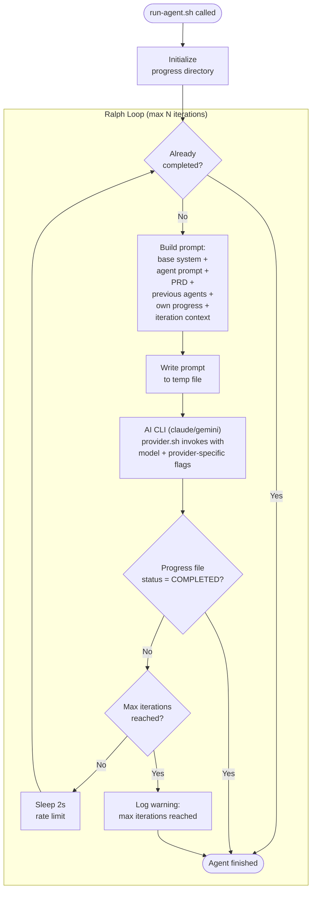
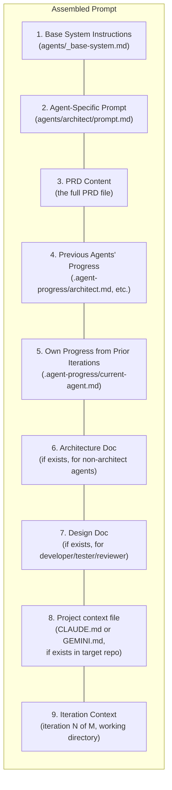
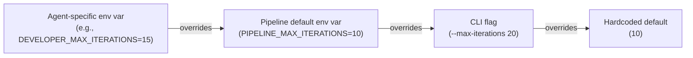

# Ralph Loop Mechanism

A Ralph Loop wraps an AI agent (Claude Code or Gemini CLI) in an iterative execution cycle. Each iteration gets a fresh context window, with progress persisted to the filesystem between iterations. This overcomes context window limits and allows self-correction. The pipeline's provider abstraction (`pipeline/lib/provider.sh`) handles CLI-specific flags, auth, and output formats for each provider.

## How It Works



## Why Ralph Loops Work

### Fresh Context Per Iteration
Each iteration invokes the AI CLI (e.g. `claude -p` or `gemini -p`) via `provider.sh`, starting a new session with a full context window. No stale context accumulates.

### Filesystem as Memory
Progress, decisions, and artifacts are written to `.agent-progress/<agent>.md` and `docs/architecture/`. Each iteration reads this file to understand what's already been done.

At pipeline start for a new PRD, previous `.agent-progress/*.md` files are cleared to ensure each PRD executes a fresh Architect → Reviewer sequence.

### Self-Correction
If an iteration produces incorrect code or misses a task, the next iteration sees the current state (including failing tests or incomplete tasks) and can correct course.

## Prompt Assembly Per Iteration

The prompt is assembled from multiple sources, layered in this order:



## Completion Detection

An agent is considered `COMPLETED` when its progress file contains:

```markdown
## Status: COMPLETED
```

The `is_agent_completed()` function in `pipeline/lib/progress.sh` parses this status. If the status is `COMPLETED` at the start of an iteration, the loop exits immediately.

## Iteration Limits

Iteration limits can be configured at three levels (highest priority wins):



## Session Resume

To resume an agent session interactively (e.g. after a pipeline pause or for debugging):

```bash
# Claude Code
claude --resume <session-id>

# Gemini CLI
gemini --resume <session-id>
```

Session IDs are shown in pipeline output and can be listed with `ca monitor --sessions`.

## Cost Implications

Each iteration consumes API tokens. A typical iteration uses 10K-50K input tokens (prompt) and 2K-10K output tokens (response). With Claude Opus 4.6:

| Scenario | Iterations | Est. Input Tokens | Est. Cost |
|----------|-----------|-------------------|-----------|
| Simple agent (architect) | 2-3 | 30K-60K per iteration | $2-5 |
| Complex agent (developer) | 5-15 | 50K-100K per iteration | $10-30 |
| Max iterations hit | 10 | 50K per iteration | $15-25 |

Set `MAX_ITERATIONS` conservatively and monitor logs to calibrate.
