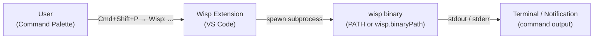

# VS Code Extension Feature Guide

> This document tracks the latest released version of the Wisp extension. The command list reflects what is registered in `vscode-extension/package.json`.

The Wisp extension for VS Code lets you invoke the `wisp` CLI directly from the Command Palette without switching to a terminal. Each command maps 1:1 to a `wisp` CLI subcommand, spawned as a subprocess.

## How It Works



The extension finds the `wisp` binary by checking `wisp.binaryPath` first, then falling back to your system `PATH`. No extension-specific server runs in the background — the extension is a thin launcher.

## Getting Started

1. **Install the extension** — search "Wisp" in the Extensions view (`Cmd+Shift+P` → **Extensions: Install Extensions**) and click Install. Or see [Installation Guide](vscode-install.md) for VSIX and source install options.
2. **Open a wisp workspace** — open a folder that contains a `manifests/` directory or `prds/` directory. This triggers the extension to activate.
3. **Verify the extension works** — open the Command Palette (`Cmd+Shift+P` / `Ctrl+Shift+P`) and run **Wisp: Show Version**. You should see the `wisp` version string in the output.

If the command reports that the binary is not found, set `wisp.binaryPath` in your VS Code settings (see [Configuration](#configuration) below).

## Commands

| Command ID | Title | Description | How to Invoke |
|------------|-------|-------------|---------------|
| `wisp.showVersion` | **Wisp: Show Version** | Runs `wisp --version` and displays the output | Command Palette → **Wisp: Show Version** |

> Commands for `orchestrate`, `pipeline`, `run`, `generate`, `monitor`, and others will be added as PRD 01 work lands. This table reflects the current `package.json`.

## Configuration

### `wisp.binaryPath`

| Property | Value |
|----------|-------|
| Type | `string` |
| Default | `""` (empty — use system `PATH`) |
| Scope | Machine-overridable |

Set this to the absolute path of the `wisp` binary when `wisp` is not on your system `PATH`, or when you want to pin to a specific build.

**Examples:**

```jsonc
// settings.json
{
  // Use a specific release build
  "wisp.binaryPath": "/usr/local/bin/wisp",

  // Use a dev build from source
  "wisp.binaryPath": "/home/user/projects/wisp/target/release/wisp"
}
```

Leave the setting empty (the default) to let the extension discover `wisp` from `PATH`.

> **Security note:** `wisp.binaryPath` is scoped `machine-overridable`, not `workspace`. This prevents a repository's workspace settings from redirecting the extension to an untrusted binary. If you see this setting in a workspace's `.vscode/settings.json`, it will not take effect — only user or machine settings apply.

## Activation

The extension activates automatically when:

- Any `wisp.*` command is invoked from the Command Palette
- The open workspace contains a `manifests/*.json` file
- The open workspace contains a `prds/**/*.md` file

No manual activation step is needed for normal use.

## Troubleshooting

### Binary not found

**Symptom:** Running a Wisp command shows an error like `wisp: command not found` or `spawn wisp ENOENT`.

**Fix:** Either add `wisp` to your system `PATH`, or set `wisp.binaryPath` in VS Code User Settings to the absolute path of your `wisp` binary. See [Installation Guide — Verification](vscode-install.md#verification) for how to check that `wisp` is accessible.

### Extension not activating

**Symptom:** Wisp commands do not appear in the Command Palette.

**Fix:** The extension activates when a workspace contains `manifests/` or `prds/` directories, or when any `wisp.*` command is invoked. If neither condition is met, open the folder that contains your wisp workspace, or trigger activation by searching for "Wisp" in the Command Palette.
